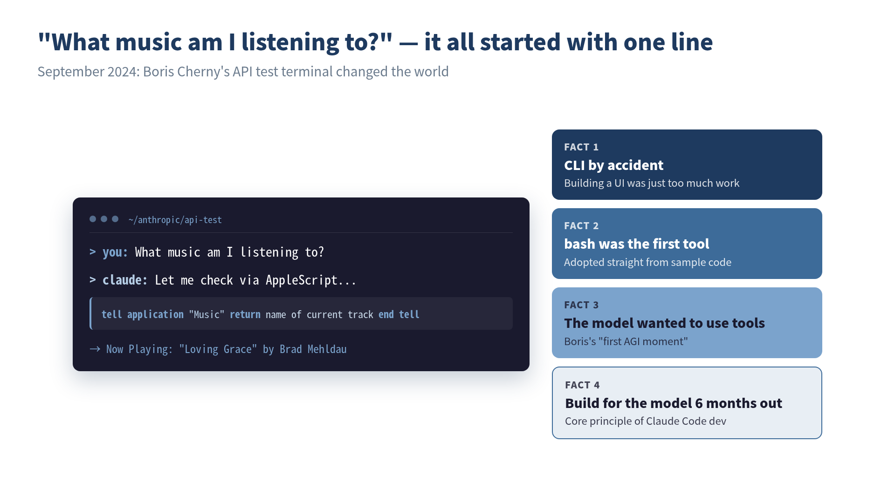

> **"So, what music are you listening to right now?" That single question started it all.**


*The iconic moment Claude Code was born — an accidental prototype that crystallized four design decisions.*

## "What Music Am I Listening To?"

:::message
 **What you'll learn in this chapter**
- How Claude Code was born as an "accidental product"
- Boris Cherny's design philosophy and its parallels with TypeScript
- The pivotal discovery that "models want to use tools"
- How Anthropic's safety culture shaped Claude Code's design
- The development principle of "build for the model six months from now"
:::

One evening in September 2024, Anthropic engineer Boris Cherny was writing a simple terminal chat app to test the behavior of the company's API.

The first tool was just `bash`: a single tool. It was an unremarkable prototype, built almost entirely from sample code in the official documentation. To verify it worked, he typed:

```
What music am I listening to?
```

The model spontaneously wrote an AppleScript, controlled the Mac's music player, and returned the name of the song currently playing.

Boris has said that this was the moment he "first felt AGI." Despite never being instructed to do so, the model **wanted to use tools**. "The model wants to use tools. That's all it is." This discovery was the very beginning of Claude Code.

## Who Is Boris Cherny?

To tell the story of Claude Code's birth, we first need to know its creator, Boris Cherny.

He is known as the author of *Programming TypeScript*, published by O'Reilly, and is an expert in type systems and programming language design. TypeScript embodies a philosophy of "adapting the type system to fit how programmers write, rather than forcing programmers to change their habits." This philosophy would later directly inform the design principles of Claude Code.

When Boris joined Anthropic, he had no plans to build a product like Claude Code. What he wanted was to gain a deeper understanding of the company's own API. The small terminal app he built for that purpose ended up becoming one of the most widely used AI coding agents in the world, something even he couldn't have predicted.

I'm drawn to this story because it resonates with my own experience. During my time in robotics development, I once built a small prototype with a French engineer that grew in unexpected directions. Rather than drawing up a grand design from the start, there's a sense that **discovery comes from getting your hands dirty**, something I think every engineer has felt at some point.

## Born from a Company Hackathon, by Chance

Claude Code was not the result of a planned product development effort. The terminal app Boris built to test API behavior was purely a personal experiment tool.

However, two fortunate coincidences came together.

**Coincidence #1: Choosing a CLI**

Boris chose a CLI for an extremely practical reason: **he didn't have to build a UI**. He picked the terminal as the cheapest possible prototype. No web UI, no desktop app. Just text in, text out: the simplest form possible.

This "shortcut" turned out to be the best design decision. The terminal was the environment developers were most familiar with, and also the most natural environment for models to use tools.

**Coincidence #2: Making bash the first tool**

By using the bash tool straight from the documentation's sample code, the model gained an environment where it could freely execute commands. This wasn't an intentional design choice. It just happened that way. But this degree of freedom perfectly matched the model's tendency to "want to use tools."

When Boris shared this prototype internally, the reaction was unexpected. Engineers at Anthropic started **using the tool in their daily work**.

## "Nobody Asked for It, but Everyone Needed It"

By late 2024, the AI coding tool market already had strong players like Cursor and GitHub Copilot. IDE-integrated AI assistants were the mainstream, and there was virtually no demand for "writing code by chatting with AI in the terminal."

Yet the rapid internal adoption of Claude Code revealed an important truth: **people don't know what they need until they have it**.

Boris explains this using the concept of **"Latent Demand."** Engineers were already working in the terminal. Claude Code was a tool that naturally blended into their existing workflow. You just use your usual terminal, work as you always have, except now Claude is right there beside you.

This idea of "placing the product on the extension of existing behavior patterns" is one of the most important factors behind Claude Code's success. I'll cover this in detail in Chapter 3.

## What Anthropic's Culture Produced

You can't tell the story of Claude Code's birth without considering the culture of Anthropic as a company.

Anthropic is unique in the industry for placing "AI safety" at the core of its corporate mission. It pursues the seemingly contradictory goals of maximizing AI capability while simultaneously ensuring its safety.

How this culture influenced Claude Code is evident in several design decisions.

**Permission Management for Tool Execution**

Claude Code has a built-in mechanism that asks for user approval when the model modifies files or executes commands. Rather than "letting AI do whatever it wants," the design philosophy is to **let humans retain control**.

```
Claude wants to run: rm -rf node_modules && npm install

Allow? (y/n)
```

This prompt might seem tedious at first glance. But it's the technical implementation of Anthropic's emphasis on "human oversight."

**Designed Not to Send Code Externally**

Claude Code doesn't store your codebase in a vector DB or build indexes on external servers. The architecture where the model directly searches local files via grep/glob is **also an excellent choice from a security perspective**.

This decision was initially made for technical reasons (Agentic Search was more accurate than RAG), but it aligned beautifully with Anthropic's safety-first culture.

**Awareness of ASL (AI Safety Level)**

Boris himself has openly discussed risks including ASL4 (the risk level for recursively self-improving models), bioweapon misuse, and zero-day exploits in interviews. The very fact that an AI coding tool developer publicly discusses these risks reflects Anthropic's culture.

When I first started using Claude Code, the first thing I noticed was this "care for safety." Compared to other AI coding tools, Claude Code **intentionally restricts what it can do** in certain areas. That restriction is a design choice, not a limitation. Rather than letting it run free, it's designed to collaborate with humans. This philosophy is what ultimately creates trustworthiness in real-world use.

## Twenty Pull Requests a Day

The most compelling evidence of Claude Code's effectiveness comes from Anthropic's own internal results.

Boris's own work style changed dramatically before and after adopting Claude Code:

- Since Opus 4.5, he writes **100%** of his code with Claude Code
- He has uninstalled his IDE
- He submits **20** pull requests per day

The team as a whole has reported results like:

- **150% increase** in productivity per engineer
- CEO Dario's prediction that "90% of code will be written by Claude" has come true
- Depending on the team, **70–90%** of code is AI-generated

Former Google engineer Steve Yegge has said that "Anthropic engineers are 1000x more productive than Google engineers in Google's heyday." That may be an exaggeration, but the sense that productivity has shifted to an entirely different dimension is something I've experienced myself through extensive use of Claude Code.

In my case, I run five projects in parallel at a small company while simultaneously taking open college courses and preparing new business ventures. This kind of "wearing many hats" work style has become possible in large part thanks to Claude Code. The dramatic reduction in time spent writing code has allowed me to **focus on decision-making and review**.

## Not a Single Line of Code from Six Months Ago Remains

The Claude Code development team itself practices an interesting development methodology.

According to Boris, **not a single line of code from six months ago remains** in the Claude Code codebase. They add and remove tools every few weeks; code has a lifespan of a few months. They constantly rewrite code to keep pace with model evolution.

This reflects his philosophy that "scaffolding = technical debt."

> You can get 10–20% performance improvements with code around the model (scaffolding). But the next model wipes out those improvements. It's always a tradeoff between building and waiting.

Boris reportedly has Rich Sutton's essay **"The Bitter Lesson"** framed on his office wall. The core thesis of this essay is that "in the long run, scaling computation outperforms human ingenuity." In other words, rather than building complex systems around the model, it's better to **bet on the evolution of the model itself**.

This thinking leads to the core principle of Claude Code development:

> Build not for today's model, but for the model six months from now.

Even if you find PMF (Product Market Fit) by optimizing for today's model, the next model will let competitors overtake you. So you sense the boundaries of model capability and bet on the frontier that will be resolved in six months.

This principle holds important implications for us as Claude Code users. Whether it's how we write CLAUDE.md or how we design workflows, the key is to **keep things simple, assuming the model will evolve**, rather than hacking around the current model's weaknesses.

## From Coincidence to Inevitability

Claude Code's birth was coincidental. A terminal app for API testing, the bash tool from sample code, choosing a CLI because "building a UI was too much trouble." None of it was intentional.

But what unfolded beyond those coincidences was inevitable:

- Engineers were already working in the terminal → CLI
- Models wanted to use tools → bash
- Security and simplicity were needed → Agentic Search
- Human control was necessary → approval-based permission management

Everything was a response to **demand that was already there**.

What I want to convey in this book isn't just how to use Claude Code. By understanding the philosophy behind its creation ("don't fight the model," "uncover latent demand," "build for six months from now"), you'll discover **principles for developing alongside AI** that go beyond mere tool usage.

In the next chapter, we'll dig deeper into the question "Why the terminal?" and get to the heart of Claude Code's design philosophy.


## ✅ Key Takeaways

- Claude Code wasn't a planned product. It was born accidentally from an API testing tool
- The discovery that "models want to use tools" was the beginning of everything
- The choices of terminal, bash, and Agentic Search were all responses to "existing demand"
- Anthropic's safety culture led to a design philosophy that keeps humans in control
- "Build not for today's model, but for the model six months from now" is the core development principle of Claude Code

---

**References**

- Boris Cherny, "Inside Claude Code With Its Creator" — Y Combinator The Light Cone (2026-02-17)
