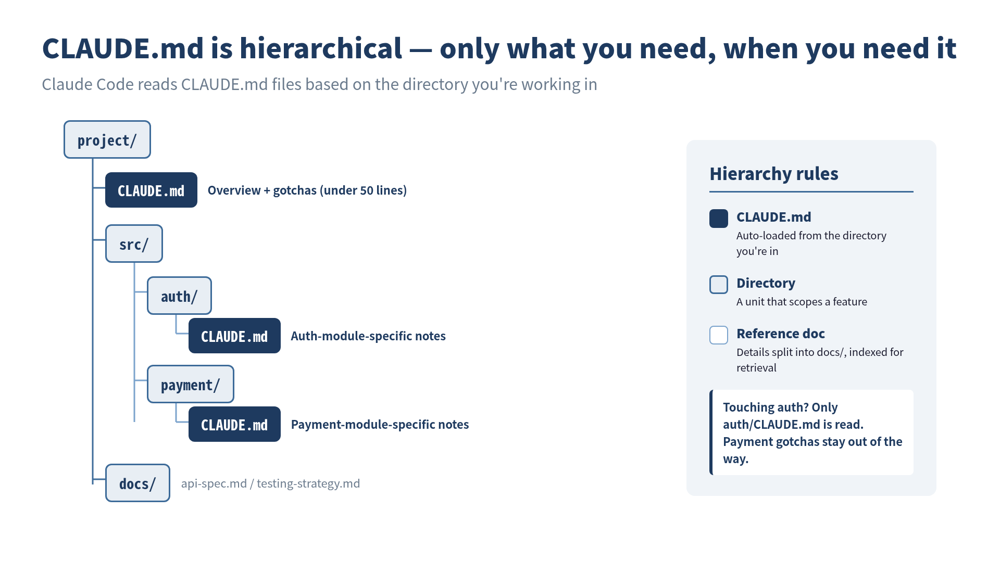

> **CLAUDE.md is not a "command sheet for the model." It's a "knowledge base for the project."**
## Boris Cherny's Two Lines

:::message
 **What you'll learn in this chapter**
- The true intent behind Boris Cherny's 2-line CLAUDE.md and common misconceptions
- The pros and cons of CLAUDE.md: the bloat problem and countermeasures
- Seven practical principles for CLAUDE.md management
- The essence of context engineering
- The relationship between Spec-Driven Development (SDD) and CLAUDE.md
:::

Let's revisit a fact from Chapter 1. Boris Cherny, the creator of Claude Code, has a CLAUDE.md that is **just two lines long**.

```markdown
# CLAUDE.md
- Enable automerge when opening a PR
- Post to the internal Slack channel when opening a PR
```

That's it. No coding conventions, no architecture descriptions, no testing guidelines.

Meanwhile, Claude Code practitioners write CLAUDE.md files exceeding 100 lines. They pack in everything: the project's tech stack, coding conventions, file structure, testing strategy, deployment procedures, all in a massive CLAUDE.md stuffed with every imaginable piece of information.

What does this gap mean?

## Why Boris Can Get Away with Two Lines

The answer is simple. Boris's CLAUDE.md is two lines because the rest of the information is consolidated in the **team-wide CLAUDE.md**.

In the Claude Code project, there is a shared CLAUDE.md at the repository root, separate from individual CLAUDE.md files, and it is **updated multiple times a week**. Boris's personal file is just two lines because the shared CLAUDE.md covers the team's context.

In other words, it's dangerous to casually conclude that "CLAUDE.md should be short." More precisely, **your personal CLAUDE.md can be short, but the project's context must exist somewhere**.

## The Pros and Cons of CLAUDE.md

CLAUDE.md is one of Claude Code's most innovative features, but it is also **the most easily misunderstood**. Shingo Yoshida, author of the book *Claude Code in Practice*, analyzes the pros and cons of CLAUDE.md in the context of Spec-Driven Development (SDD).

### Pro: Persisting Project Knowledge

The greatest advantage of CLAUDE.md is that it is **the only context that survives `/clear`**.

Claude Code sessions are temporary. When the context window fills up or you reset with `/clear`, all prior conversation is lost. But information written in CLAUDE.md persists permanently in the project and is automatically loaded in the next session.

```
Session 1: Instruct "write tests with Vitest" → Done
  ↓ /clear
Session 2: "Add tests" → Doesn't remember Vitest ❌

With CLAUDE.md:
Session 2: "Add tests" → Knows to use Vitest from CLAUDE.md ✅
```

This means CLAUDE.md functions as **long-term memory**.

### Con: The Bloat Problem

However, CLAUDE.md functioning as long-term memory is simultaneously **a cause of bloat**.

Every time Claude makes a mistake during a session, you add a rule: "do this from now on." Every time the project grows, you add new context. Before you know it, CLAUDE.md has ballooned to 300, 500, 1000 lines.

A bloated CLAUDE.md has the following problems:

**Problem 1: The model starts ignoring instructions**

LLMs have a tendency to "weight the beginning and end of input more heavily." Instructions buried in the middle of a massive CLAUDE.md are more likely to be ignored by the model.

**Problem 2: Contradictory instructions accumulate**

When you keep appending over a long period, old instructions and new instructions can contradict each other. An old instruction saying "write tests with Jest" coexists with a new one saying "tests have been migrated to Vitest."

**Problem 3: Wasting the context window**

CLAUDE.md is loaded in its entirety at session start. A 1000-line CLAUDE.md significantly eats into the context window available for actual tasks.

Boris himself has given clear advice on this problem:

> If CLAUDE.md gets too long, **delete it and start over**. If the model goes off track, nudge it back gradually. As models improve, you'll need to add less.

## Seven Principles for CLAUDE.md

With the pros and cons in mind, here are practical operating principles. These seven principles are synthesized from knowledge accumulated in the community.

### Principle 1: Keep It Small and Focused

```markdown
# ✅ Good: Minimal essentials
This project is Next.js 14 App Router + TypeScript + Prisma.
Tests use Vitest. Run all tests with `npm test`.
Japanese comments preferred.

# ❌ Bad: Information overload
This project is an e-commerce site built with Next.js 14
App Router + TypeScript + Prisma. Development started in
March 2024, the team has 3 members... (goes on and on)
```

Aim for **under 300 lines, with no more than 150–200 instructions**. Auto-generation via `/init` tends to be verbose, so always curate manually after generation.

### Principle 2: Leave Code Style to Linters/Formatters

```markdown
# ❌ Things that shouldn't be in CLAUDE.md
Use 2-space indentation.
Omit semicolons.
Use single quotes for strings.

# ✅ What to do instead
Configure .prettierrc and .eslintrc
→ A single line in CLAUDE.md: "Follow Lint/Formatter rules for code style"
```

This is the practice of "Don't fight the model" explained in Chapter 2. Delegate formatting control to tools, and write in CLAUDE.md only **what you want the model to exercise judgment on**.

### Principle 3: The Three Essential Elements

There are three things CLAUDE.md should contain at minimum:

```markdown
# CLAUDE.md

## Project Overview
Next.js 14 e-commerce site with product management, orders, and payment features.

## Common Commands
- `npm run dev` — Start dev server
- `npm test` — Run tests
- `npm run build` — Build
- `npx prisma migrate dev` — DB migration

## Project-Specific Gotchas
- If: Prisma schema changed → Then: Always run `npx prisma generate`
- If: Environment variable added → Then: Update `.env.example` too
- If: API route added → Then: Update type definitions in `src/lib/api-client.ts`
```

The third element, "Project-specific gotchas," is particularly important. Write gotchas not just as prohibitions but in **"If X, then Y" (trigger + action) format**. This makes it easier for the model to understand precisely.

### Principle 4: Progressive Disclosure

You don't need to put everything in CLAUDE.md. Separate details into dedicated files in subdirectories, and include only references in CLAUDE.md.

```markdown
# CLAUDE.md (root)
See docs/api-spec.md for detailed API specifications.
See docs/testing-strategy.md for testing strategy.
See docs/deploy.md for deployment procedures.
```


*CLAUDE.md is placed hierarchically — Claude Code automatically reads only the files relevant to the directory it is working in.*

Claude Code automatically loads the CLAUDE.md in the directory it's working in. When working on auth, `src/auth/CLAUDE.md` is loaded; when working on payments, `src/payment/CLAUDE.md` is loaded. A design that provides **the right information at the right time**.

### Principle 5: Put Critical Rules at the Top

LLMs tend to weight the beginning and end of input more heavily. Place your most important rules at the **top** of CLAUDE.md.

```markdown
# CLAUDE.md

<!-- Most critical rules: place here -->
⚠️ Never connect directly to the production DB. Always use staging.
⚠️ Never commit .env files.

## Project Overview
...
```

### Principle 6: Grow It as a Living Document

CLAUDE.md isn't something you write once and forget. When Claude repeats the same mistake, add a one-line lesson. When the project's situation changes, update it. It's a document that requires **continuous maintenance**.

However, if you only ever add, it bloats. Review periodically and delete rules that are no longer relevant. As Boris says, sometimes you need the courage to "delete it and start over."

### Principle 7: Be Mindful of Scope

The placement of CLAUDE.md determines its scope.

```
~/.claude/CLAUDE.md          # Global (shared across all projects)
~/project/CLAUDE.md           # Project root
~/project/src/auth/CLAUDE.md  # Module-specific
~/project/claude.local.md     # Personal settings (.gitignore recommended)
```

Put team-shared rules in the project root CLAUDE.md, and personal preferences in `claude.local.md`, to **clearly separate shared knowledge from personal settings**.

## The Essential Question: "What Is Context?"

When you think deeply about CLAUDE.md design, you arrive at the fundamental question: **"What is context?"**

Context is the information the model needs to make correct decisions. But "needed information" changes depending on the situation:

- When grasping the project's big picture → architecture description
- When fixing a specific bug → that module's specific gotchas
- When writing tests → testing strategy and test tool configuration
- When deploying → deployment procedures and environment settings

Providing all information at once overwhelms the context window and buries important information. Providing only the needed information at the needed time: that is the essence of **context engineering**.

CLAUDE.md is merely a mechanism for practicing this context engineering.

## The Connection to Spec-Driven Development (SDD)

**Spec-Driven Development** (SDD), advocated by Shingo Yoshida, is an approach that takes the philosophy of CLAUDE.md even further.

The difference from vibe coding ("just make something nice") is clear:

```
Vibe Coding:
  "Make a login feature" → AI implements freely → Not what you expected

Spec-Driven Development:
  1. Write the spec (clarify what to build)
  2. Set steering policies in CLAUDE.md (clarify how to build it)
  3. Have AI implement → Implementation follows the spec
  4. Verify results → Update the spec
```

The core of SDD is concentrating human effort not on **"instructions to AI"** but on **"defining the specification."** With a good spec, AI can arrive at the correct implementation.

This is also the approach I practice daily. Before writing code, I write the spec first. I set the project context in CLAUDE.md. Then I delegate implementation to Claude Code. **What you should write is not code, but specifications**.

This idea connects deeply with the "Document-First Development" discussed in the next chapter.

## A Practical CLAUDE.md Template

Finally, here's the CLAUDE.md template I actually use.

```markdown
# CLAUDE.md

## ⚠️ Critical Rules
- Do not access production environment directly
- Do not commit .env files
- Always ask for confirmation before destructive migrations

## Project Overview
[Project name]: [One-line description]

## Tech Stack
- Framework: Next.js 14 (App Router)
- Language: TypeScript (strict mode)
- DB: PostgreSQL + Prisma
- Testing: Vitest + Testing Library
- CI: GitHub Actions

## Commands
- `npm run dev` — Dev server
- `npm test` — Run tests
- `npm run test:watch` — Test watch
- `npm run build` — Build

## Gotchas (If → Then)
- If: New API route added → Then: Update types in `src/types/api.ts`
- If: Prisma schema changed → Then: Run `npx prisma generate`
- If: Environment variable added → Then: Update `.env.example` + document in README

## References
- API spec: docs/api-spec.md
- Testing strategy: docs/testing.md
```

It fits within 50 lines. Detailed information is separated into referenced documents, and CLAUDE.md serves as **an index**. 

Boris's 2-line CLAUDE.md might be extreme, but the direction is right. **Don't write what doesn't need to be written**. Place the necessary information in the right place at the right granularity. That is the essence of CLAUDE.md management.


## ✅ Key Takeaways

- Boris Cherny's 2-line CLAUDE.md works because the team-shared CLAUDE.md provides coverage
- CLAUDE.md bloat causes three problems: ignored instructions, accumulated contradictions, and wasted context
- The core of the seven principles: "keep it small and focused," "leave it to linters," and "If-Then gotchas"
- Progressive disclosure provides the right information only when needed
- Design CLAUDE.md not as "orders to the model" but as "the project's knowledge base"

## 🎯 Try It Yourself

1. **Write a CLAUDE.md for your project**: Following the seven principles in this chapter, write a CLAUDE.md of 50 lines or less for a project you're currently working on. Be sure to include the three essential elements: project overview, commands, and gotchas (in If→Then format).
2. **Put a bloated CLAUDE.md on a diet**: If you already have a CLAUDE.md, review it against this chapter's principles and remove unnecessary content. Identify items that should be left to linters/formatters, duplicate instructions, and outdated rules. Compare the line count before and after.

---

**References**

- Boris Cherny, "Inside Claude Code With Its Creator" — Y Combinator The Light Cone (2026-02-17)
- Shingo Yoshida, "Introduction to Spec-Driven Development with Claude Code" — SpeakerDeck
