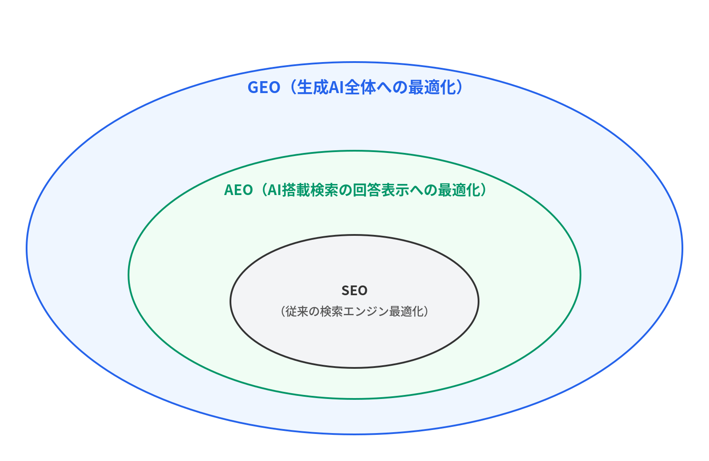

# Chapter 1: The Day SEO Breaks

> **Your SEO efforts? AI isn't watching.**

## What My AI Agent Taught Me

One day in 2026, I was reviewing the logs of my AI agent when I noticed something strange.

I use an AI agent framework called OpenClaw. I delegate day-to-day research and information gathering to a Claude-based (Anthropic's LLM) agent. When I happened to check what this agent, "Iris," was using to execute web searches, here's what I found:

Brave Search API.

Not Google.

As a freelancer working on multiple projects, one of my engagements involved SEO (Search Engine Optimization). I'd been carefully structuring headings, optimizing meta descriptions, and designing internal links. All to rank higher on Google's search results.

But my AI agent wasn't looking at Google at all.

This discovery was a shock. The search engine I'd been optimizing for and the search engine my AI actually used to retrieve information were completely different things.

Further investigation revealed that this wasn't unique to my agent. Anthropic's Claude uses Brave Search as its search backend. Perplexity also uses Brave as one of its search sources. Many AI coding assistants are beginning to offer integration with the Brave Search API.

In other words, many of the AI tools that proliferated rapidly from 2024 to 2025 use Brave Search rather than Google when retrieving information.

When you ask a technical question using Gemini CLI, Reddit's `r/programming` threads sometimes get cited as answer sources. With Claude in Chrome, the AI references information from X (formerly Twitter) timelines open in your browser to generate responses.

No matter which AI tool you examine, the information retrieval path doesn't go through Google's search results pages. The act of AI "searching for information" and the act of a human "Googling something" are now entirely separate phenomena.

## Google's 20-Year Reign

Let's rewind a bit.

Google began to dominate the search market in the early 2000s. Its PageRank algorithm, which numerically scored web page importance based on the principle that "pages linked to by many quality sites are more important," overwhelmed the directory-based search engines of the time and created a culture where "searching" meant "Googling."

As of 2024, Google's global search share stands at approximately 90%. Roughly 85% on desktop and about 95% on mobile. The remainder is split among Bing, Yahoo!, DuckDuckGo, and others.

For engineers and marketers working on the web, "search optimization" has effectively meant "Google optimization." We've spent 20 years reacting to every Google algorithm update, adapting to Core Web Vitals, and crafting content with E-E-A-T (Experience, Expertise, Authoritativeness, Trustworthiness) in mind. This has been the common wisdom for two decades.

That premise is now beginning to crumble.

## From "Ten Blue Links" to "One AI Answer"

Picture a Google search results page. Titles and snippets lined up as "ten blue links." This has been the fundamental search experience. Users click links, visit individual sites, and synthesize information to form their own judgments.

However, since ChatGPT's arrival, user information-seeking behavior has fundamentally changed.

"Ask ChatGPT." "Look it up on Perplexity." "Consult Gemini." These behaviors are rapidly becoming mainstream, especially among technical professionals. Instead of browsing multiple sites, users ask AI a question and receive a single, synthesized answer.

The data backs up this shift:

- **27%** of US users substitute AI chatbots for everyday searches (February 2025 survey)
- Gartner predicts **a 25% decline in traditional search engine traffic by 2026**
- The display of AI Overviews caused Google's #1 ranking CTR (click-through rate) to **drop by 34.5%** (Ahrefs study, 300,000 keywords)

Meanwhile, AI-driven referral traffic has increased **357% year-over-year** (SimilarWeb). This means the overall search traffic pie isn't changing so much as the channel through which people find information is shifting dramatically.

The critical point here is that this change is irreversible.

Once users experience the convenience of getting an instant answer from AI, they won't go back to "ten blue links." It's the same as how nobody went back to the abacus after calculators became widespread. This is especially true for efficiency-minded professions like engineering.

I've personally noticed a change in what I do first when a technical question arises. I used to search Google for Stack Overflow answers. Now I ask Claude Code or Gemini CLI directly. It's faster, more accurate, and produces answers tailored to my context.

## The Birth of LLMO: A New Field

A new optimization domain has emerged to address this change. That domain is LLMO: Large Language Model Optimization.

LLMO is the art of optimizing your content so that it gets referenced and cited in responses from large language models like ChatGPT, Claude, Gemini, and Perplexity.

While traditional SEO aimed to "rank higher on Google's search results pages," LLMO aims to "be cited as an information source within AI-generated answers."

This distinction is fundamentally important for engineers.

In SEO, Google's crawler indexes your site and its algorithm determines rankings. The optimization target is clear, and the feedback loop is relatively well-established (through Search Console, for example).

In LLMO, the situation is entirely different.

First, how an LLM "knows" your content is complex. There's the pathway of being incorporated into pre-training data, the pathway of being searched in real-time through RAG (Retrieval-Augmented Generation), and the pathway where AI agents independently retrieve information. At least three pathways exist (Chapter 2 covers this in detail).

Second, there isn't just one "search engine" to optimize for. ChatGPT uses Bing (potentially SearchGPT in the future), Claude uses Brave Search, and Gemini uses Google Search. Each platform references different search infrastructure.

Furthermore, AI responses are probabilistic. Even with the same question, the same sources won't necessarily be cited every time. The response and its citations vary based on the temperature (randomness) parameter, query time, user location, model version, and other factors.

In short, LLMO is an optimization problem that is inherently more complex, uncertain, and multi-platform than SEO.

## Terminology: LLMO / GEO / AIO / AEO

Let's organize the terminology in this field. Since the industry hasn't yet settled on a unified name, multiple terms coexist.

### LLMO (Large Language Model Optimization)

Content optimization for being cited and referenced in LLM responses. This book primarily uses this term because it's the most technically precise, with a clear target (LLMs).

### GEO (Generative Engine Optimization)

Optimization for generative AI engines broadly. Defined in a paper published at KDD 2024 by a Princeton University research team. This is the standard term in academia, and it's also gaining traction in overseas marketing circles.

However, in Japan, searching "GEO" returns results for a rental DVD chain called "GEO," which creates a barrier to adoption of the term.

### AIO (Artificial Intelligence Optimization)

A general term for content and site structure optimization for AI overall. Relatively common in Japan, but it's also used as an abbreviation for "AI Overviews" (Google's generative AI answer feature), creating contextual ambiguity.

### AEO (Answer Engine Optimization)

Answer engine optimization. Aims to appear in "instant answers" from AI-powered search features like Google AI Overviews, Bing Copilot, and Perplexity. A slightly narrower concept than GEO, focused on "search engine AI answer features."

### The Three-Layer Model

The three-layer model proposed by Jasper's blog is useful for understanding the relationship between these terms:

SEO forms the foundation, AEO sits on top of it, and GEO is layered above that. The key insight is that **GEO and AEO don't replace SEO**. They are additional layers on top of SEO. Abandoning SEO to focus solely on GEO is a mistake.

Semrush's survey data supports this as well. ChatGPT users are not abandoning Google Search. Rather, AI usage is expanding overall search behavior.

This book primarily uses "LLMO" for technical precision, but also uses GEO and AEO depending on context. Regardless of which term appears, understand that they all fundamentally refer to optimization aimed at getting "your content referenced in AI answers."

## Why Now: Why 2025 Is the Tipping Point

"AI will transform search" has been said for several years. So why does "now" matter?

There are concrete reasons why 2025 is the tipping point.

First, **the discontinuation of external Bing Search API access** (August 2025). This effectively left Brave Search as the only independent search API available to AI providers. The diversity of search backends collapsed overnight, and the importance of Brave optimization skyrocketed.

Second, **the explosive growth of the AI agent market**. Agent frameworks like OpenClaw, AI coding assistants like Cursor and Windsurf, custom corporate AI agents: these are being embedded into daily workflows. Agents search for information on behalf of users, gathering decision-making materials. Even without humans opening Google, AI is executing web searches. That era has arrived.

Third, **the rollout of Apple Intelligence**. With AI features shipping as standard on iPhones, mobile user search behavior could change dramatically. When over 1 billion iPhones worldwide begin offering AI search by default, the impact will be enormous.

All these changes are happening simultaneously in 2025. This is precisely why now is the time to invest in LLMO. Continuing to fight with SEO alone is like faxing clients in the smartphone era. It still works. But your reach is limited.

## LLMO as an Engineering Problem

Reading this far, some of you may be thinking, "Isn't this a marketer's job?"

It isn't. LLMO is fundamentally an engineering problem.

Traditional SEO had a heavy marketing component, with content planning and keyword research at its core, while technical implementation (structured data, Core Web Vitals, site architecture) was just one part of it.

In LLMO, the technical weight is far greater:

- Understanding the architecture of how LLMs retrieve information, process it, and generate answers
- Content structure design that accounts for RAG system Query Fan-out
- Implementation of structured data via JSON-LD
- AI crawler control through `llms.txt` and `robots.txt`
- Understanding differences across search platforms: Brave Search API, Google Search Grounding, Bing API
- Automating AI visibility measurement (monitoring via Python scripts)

These are tasks that belong to an engineer's skill set, not a marketer's.

Moreover, we engineers are "stakeholders" in LLMO.

When you use Gemini CLI to write code, when you do technical research with Claude Code, when you compare libraries on Perplexity: you're an AI search "user." At the same time, when you write tech blog posts, maintain OSS documentation, or polish API references: you're an AI search "content provider."

Engineers who hold both perspectives are best positioned to understand the reality of LLMO and to practice it most effectively.

## SEO Won't Die, But It Will Change

Finally, let me emphasize something important.

**SEO is not dead.**

Google's search share remains at 90%. The vast majority of users still search on Google. AI-driven traffic is growing rapidly, but it's still under 1% of total traffic (Ahrefs study).

However, the quality of that sub-1% traffic is exponentially higher.

Ahrefs research reports cases where the conversion rate of LLM-driven visitors was **up to 23 times higher** than organic search (AI search visits accounted for 0.5% of total traffic but 12.1% of sign-ups). SimilarWeb's global e-commerce data shows AI-driven conversion rates at **11.4%** versus **5.3%** for organic search, roughly a 2x gap. Semrush data indicates that the average conversion rate from LLM-referred visitors is **4.4 times** that of traditional search traffic.

Low volume but overwhelmingly high quality. That's the defining characteristic of AI search traffic.

And this "volume" is growing at a pace of several hundred percent per year. If Gartner's prediction holds and traditional search declines 25% by 2026, much of that traffic will flow through AI channels.

As an engineer, if you care about the visibility of your tech blog or OSS project, there is more than enough reason to start working on LLMO now. You don't need to abandon SEO. Layer LLMO on top of SEO. That is the fundamental strategy for information dissemination on the web going forward.

This book is your practical guide to doing exactly that. Reverse-engineering from LLM internals, and from an engineer's perspective, it explains what to optimize and how.

In Chapter 2, we'll take a deep technical dive into the three pathways through which information reaches LLMs: training data, RAG, and AI agent real-time search.

---

## Key Takeaways

- **AI agents search using Brave Search, not Google.** The premise of SEO strategy is breaking down.
- **User information-seeking behavior is irreversibly shifting from "ten blue links" to "one AI answer."** Gartner predicts a 25% decline in traditional search traffic by 2026.
- **LLMO/GEO/AIO/AEO are different names for the same phenomenon.** The essence is optimization to get "your content cited in AI answers."
- **SEO won't die, but SEO alone isn't enough.** A hybrid strategy that layers LLMO on top of SEO is necessary.
- **LLMO is fundamentally an engineering problem.** LLM architecture, RAG, structured data, crawler control: technical understanding is essential.
