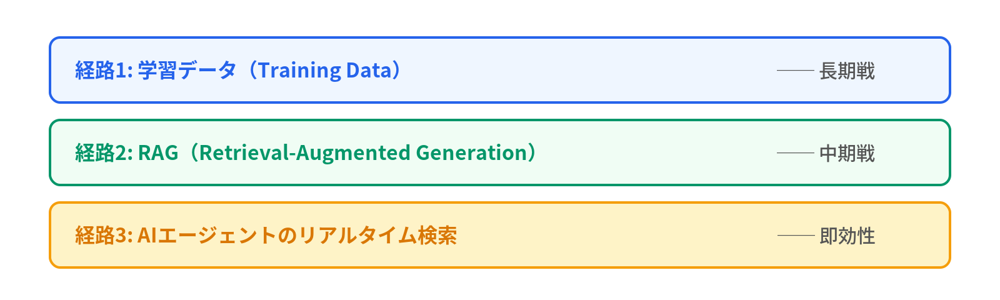
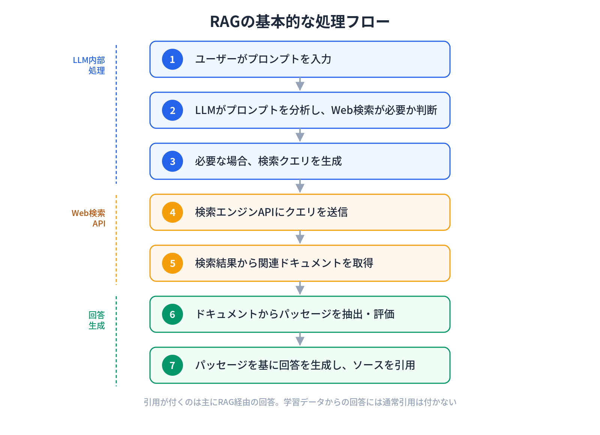
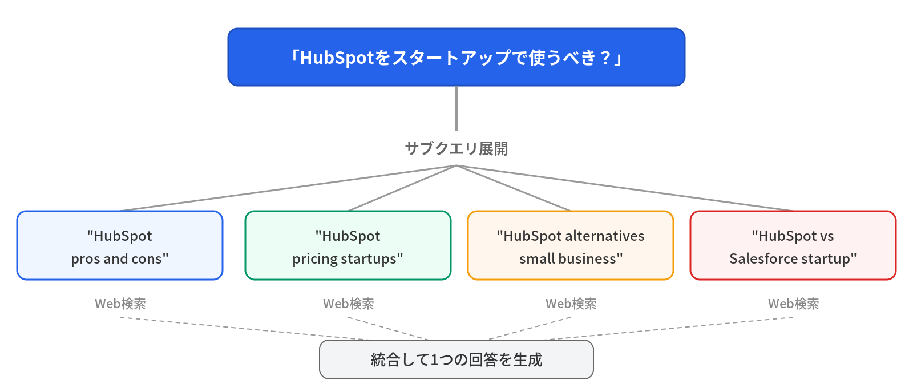
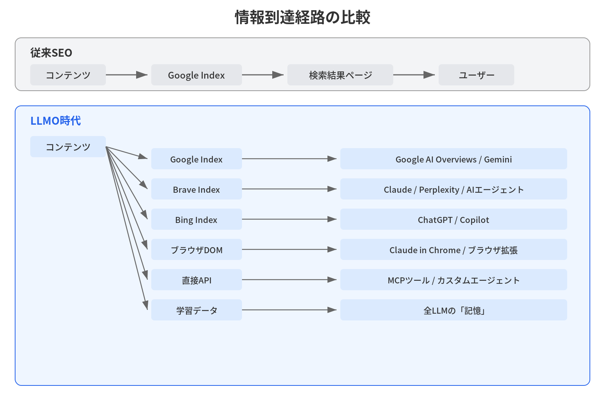

# Chapter 2: Three Pathways Information Reaches LLMs

> **Why your site doesn't appear when someone asks ChatGPT.**

Say you've written a tech blog post. You've done your SEO and you're ranking well on Google. But when someone asks ChatGPT a related question, your article is never cited.

Why?

The answer is simple. The pathway through which an LLM "knows" your content and the pathway through which Google indexes your content are completely different.

This chapter dissects the three pathways through which information reaches LLMs from a technical perspective. Understanding each pathway's mechanics is the starting point for any LLMO strategy.

Let's use a library metaphor to grasp the big picture.

SEO is like registering your book correctly in the library catalog. LLMO, on the other hand, is about creating a situation where the librarian (AI) recommends your book to patrons: "I'd suggest this one." Even if you're in the catalog, if the librarian doesn't know about your book, they can't recommend it.

The three pathways map to the librarian's information sources. Training data is the librarian's memory of books they've read. RAG is searching the shelves on the spot. Agent search is running to the next library over to look something up.

## The Big Picture: Three Pathways

LLM "knowledge" of content can be broadly classified into three pathways.



Each has a completely different time scale for information delivery, different optimization methods, and different durability of effects. Let's examine them in order.

## Pathway 1: Training Data: The Long Game

### The Nature of LLM "Memory"

State-of-the-art LLMs like GPT-4o/o3 and Claude Sonnet 4/4.5 are pre-trained on massive text datasets. Information contained in this training data gets encoded into the model's parameters, essentially becoming the LLM's "memory."

When a user asks "How do I use React's useEffect?", the LLM uses knowledge from React documentation and blog posts it read during training to generate a response. In this case, no source citations accompany the answer, because it's generated directly from the LLM's "memory."

### GPT-3's Training Data Composition

Let's look concretely at how LLM training data is composed. GPT-3's training data composition was published in OpenAI's paper (["Language Models are Few-Shot Learners"](https://arxiv.org/abs/2005.14165), 2020, Table 2.2), and subsequent models follow roughly the same structure.

| Data Source | Token Share | Training Weight |
|---|---|---|
| CommonCrawl | 80%+ | 60% (reduced) |
| WebText2 | Small | ~22% (**6x increase**) |
| Books | Small | ~8% (increased) |
| Wikipedia | Small | ~3% (**5x increase**) |

What's notable here is the **divergence between token share and training weight**.

CommonCrawl has the largest data volume but its training weight is held to 60%. Meanwhile, Wikipedia and WebText2 have their training weights inflated 5-6x relative to their data volume.

In other words, **not all web pages are treated equally** in LLM training. Sources judged as high-quality receive greater weight.

### Influence Pathways for Each Data Source

#### CommonCrawl
This is broad crawl data from across the web. If your website isn't blocking CCBot (CommonCrawl's crawler), it's eligible for collection. However, it may be excluded during the sanitization (quality filtering) process.

This is technically the lowest-barrier pathway, but since training weight is reduced, being included here alone doesn't carry significant influence.

#### Wikipedia (5x training weight)
Nearly all LLMs give special weight to Wikipedia. Semi-structured content, strict moderation, multilingual support, semantic cross-links: Wikipedia has ideal characteristics for LLM training data.

The practical implication is clear. If your product or technology is mentioned in a Wikipedia article, the probability of it being encoded into the LLM's "memory" increases substantially. However, Wikipedia editing is notoriously difficult. Articles that don't meet notability criteria get deleted, and promotional editing can backfire.

#### WebText2 (6x training weight)
This is less well-known but extremely important.

WebText2 is a dataset built by **scraping pages from outbound links in Reddit posts that received 3 or more upvotes**.

In other words, content that the Reddit community judged as "valuable" is incorporated into LLMs with 6x training weight.

This has critical implications for technical content. If your tech blog gets shared on Reddit's `r/programming` or `r/javascript` and earns upvotes, it could be incorporated into future LLM training data with high weight.

### The Cutoff Wall

The biggest constraint of the training data pathway is the **cutoff date**.

LLM training data has a clear expiration date. For example, GPT-4o's training data extends to October 2024, and Claude Sonnet 4.5 to April 2025 (as of writing; varies by model version). Content published after the cutoff is not included in training data.

Furthermore, model retraining doesn't happen frequently. The update from GPT-3 to GPT-4 took about 3 years. That means content published today will be reflected in training data at the earliest in a few months, and typically in 1-2 years.

This is why it's called "the long game." Incorporation into training data takes the longest of any LLMO pathway, but once incorporated, it persists as part of the model's "memory" for an extended period.

### Training Data Optimization in Practice

Here are the common characteristics of content that tends to be incorporated into training data:

1. **Publication on authoritative domains**: Content featured in major media outlets (NYT, Bloomberg, etc.) influences training data through three pathways: CommonCrawl (directly) + Wikipedia citation (indirectly) + Reddit upvotes (WebText2)
2. **Natural sharing on Reddit**: Links shared in a way that provides value to the community, not spam
3. **Wikipedia mentions**: Being cited as a reliable source
4. **Publishing original data**: Primary information not available elsewhere gets cited and shared more readily, making it more likely to enter training data

## Pathway 2: RAG: The Medium Game

### How RAG Works

RAG (Retrieval-Augmented Generation) is a mechanism where LLMs perform real-time web searches to supplement information not in their "memory," then generate responses based on the retrieved information.

ChatGPT's "Browse with Bing," Perplexity's web search, and Google AI Overviews' Search Grounding are all RAG implementations.

The basic processing flow of RAG is as follows:



**Citations appear primarily in RAG-based responses.** Responses drawn from training data typically don't include citations. This means that for LLMO aimed at "getting cited by AI," RAG is the most direct target pathway.

### Query Fan-out: One Question Becomes Multiple Searches

Within RAG, the most important concept for LLMO is **Query Fan-out**.

When a user asks "Should I use HubSpot for my startup?", the RAG system internally decomposes this question into multiple sub-queries:



Each sub-query independently executes a web search, and passages are extracted from each set of search results. Finally, these passages are synthesized to generate a single answer.

SurferSEO's analysis data demonstrates the practical impact of this mechanism:

- Ranking in sub-queries → **49% more likely to be cited** than ranking in the main query alone
- Ranking in both the main query AND sub-queries → **161% more likely to be cited**

This means that at the content design stage, it's critical to anticipate "what sub-queries AI will generate for this topic" and include sections that answer each sub-query.

### Passage-Level Optimization

There's another important concept to understand for RAG pathway optimization.

LLMs evaluate and cite content at the **passage level** (paragraph/section), not at the whole-page level.

According to SurferSEO's analysis, **67.82% of AI Overviews citation sources are NOT in Google Search's Top 10**. This means that even if a page's overall SEO ranking is low, specific passages that directly answer a question can be cited by AI.

Conversely, a page that ranks #1 for SEO might not be cited by AI if the answer is buried in lengthy text or expressed ambiguously.

Key considerations for passage-level optimization:

```markdown
## Question-format heading
[1-2 sentence direct answer]

[Supporting explanation, data, evidence]
```

Design each section as a "self-contained answer." The heading is the question, followed immediately by a concise answer, with evidence and data below.

### Characteristics of Citable Content

Ahrefs analyzed roughly 60,000 sites and revealed structural characteristics of content that LLMs tend to cite:

#### 1. Freshness
AI assistants prioritize content that is **25.7% newer** than organic search results (Ahrefs study). On Perplexity, freshness accounts for approximately **40%** of ranking factors.

However, "fake freshness" where only the date is changed without updating text is detected by AI. Substantive content updates are necessary.

#### 2. Domain Authority
Analysis of the top 1,000 sites cited by ChatGPT shows that **sites with DR (Domain Rating) 60+ are dominant**. LLMs don't directly evaluate DR, but since the search engines used in RAG factor DR into their rankings, it has an indirect effect.

#### 3. Original Data
Content containing primary information not available on other sites: proprietary research data, experimental results, benchmarks. Ahrefs' most cited page being "How Much Does SEO Cost?" (an article based on their own survey data) confirms this.

#### 4. Structured Format
Clear headings, bullet points, tables, numbered lists: structures that make it easy for AI to extract passages. Microsoft's official guide also recommends "clear meaning, consistent context, clean formatting."

### Citation and Traffic Are Different Things

One important caveat here.

According to Ahrefs' analysis, **only 10% of the top 1,000 most-cited pages also appear among the top pages for ChatGPT traffic**.

Being cited and receiving traffic are not necessarily the same thing. AI may cite your article's information while presenting it to the user as an integrated part of its answer, meaning users often don't bother clicking through to the original article.

However, citations carry value beyond traffic. LLM-driven traffic, while low in volume, achieves conversion rates of **4.4x** (Semrush) to **up to 23x** (Ahrefs) compared to organic search. And the very fact that AI repeatedly cites "this source is trustworthy" builds brand authority.

## Pathway 3: AI Agent Real-Time Search: Immediate Impact

This is where this book's unique perspective comes in.

Training data (Pathway 1) and RAG (Pathway 2) are covered in many LLMO-related books. However, **the third pathway, AI agent real-time search behavior, is almost never discussed in depth.**

This is a phenomenon I observe daily through developing and operating AI agents.

### AI Agents Search via Brave API

As mentioned in Chapter 1, my AI agent (Iris on OpenClaw) retrieves information using the Brave Search API.

But this isn't unique to my agent. As the AI agent market grew rapidly from 2024 to 2025, Brave Search became the de facto default search backend.

Why Brave?

Three main reasons:

1. **API availability stability**: After Microsoft discontinued external Bing Search API access in August 2025, Brave became effectively the only independent search API option
2. **Zero Data Retention (ZDR)**: The Brave Search API has a policy of not storing any search queries. For AI providers, the fact that user queries aren't accumulated by third parties is a crucial privacy requirement
3. **LLM Context API**: In February 2026, Brave released a new API optimized for AI. It converts HTML into structured data and returns "smart chunks" broken down to the JSON-LD and table-row level

Why this third pathway matters for LLMO is that **Google's search index and Brave's search index are different**.

A page that ranks #1 on Google might be on page 5 of Brave. Conversely, a page buried on Google might rank highly on Brave. Brave Search has its own index (300 billion pages, with 100 million pages updated daily) and employs a user-behavior-based natural index construction called the Web Discovery Project.

In other words, if you want to capture traffic via AI agents, you need to ensure **visibility on Brave Search** in addition to Google SEO.

### The Daily Reality of Using Gemini CLI to Reference Reddit

One of my daily workflows involves using Gemini CLI.

Gemini CLI is Google's command-line version of Gemini, with built-in Google Search Grounding. When you ask technical questions, it automatically performs Google searches and generates responses based on the results.

What's interesting is that when you look closely at Gemini's answer sources, **Reddit technical threads are frequently cited**.

When I ask Gemini CLI about practical problems like "Caching not working with Next.js 15's App Router," Reddit's `r/nextjs` threads sometimes get cited over Stack Overflow answers. This is likely due to both Google Search's increasing valuation of Reddit (the Reddit IPO data deal from 2024 being one factor) and the fact that Reddit threads contain raw, practical answers to real-world questions.

What engineers should recognize is that **when you use Gemini CLI or ChatGPT for technical research, the "information pathways" sourcing those answers differ from traditional search**.

### Claude in Chrome: Retrieving Information via Browser Sessions

Here's another phenomenon I observe daily.

When using Claude (the Claude in Chrome extension) in the Chrome browser, it can leverage browser session information to access data from services that require login.

Specifically, when you have an X (formerly Twitter) timeline open and ask Claude a question, it reads the content of posts on the timeline and generates responses that reference them.

This is a different mechanism from typical RAG. It's not calling a web search API; it's **directly reading the browser's DOM (Document Object Model)**. In other words, it accesses web information directly through the "browser" without going through a "search engine."

This behavioral pattern will become increasingly common as AI agents evolve. Through MCP (Model Context Protocol) tool integrations, web browsing for real-time information retrieval, and even direct API calls for data collection: the means by which AI retrieves information are no longer limited to "search engines."

### From "Search Engine" to "Information Retrieval Method"

Traditional SEO was a technology for optimizing for "search engines." The target was a single platform called Google, and you just needed to optimize for its index and algorithms.

LLMO in the AI agent era is optimization for "information retrieval methods" as a whole.



The pathways through which content reaches information consumers (humans or AI) have become dramatically more diverse.

## Optimization Priority Framework for the Three Pathways

Now that we understand the three pathways, let's address the practical question: **which pathway should you prioritize for optimization?**

This depends on your goals and timeline.

### For immediate results: Pathway 2 (RAG) and Pathway 3 (Agent Search)

If you already have published content, starting with RAG and agent search citation optimization is most efficient. Simply improving content structure (headings, lists, tables) and restructuring passages to "directly answer questions" can increase your AI citation rate.

Specific actions:
- Add structured data (JSON-LD) to each article
- Use question-format headings with concise answers immediately following
- Clearly state original data and statistics (e.g., "Our research found that...")
- Update content quarterly to maintain freshness

### For medium-to-long-term investment: Pathway 1 (Training Data)

Publishing original data, getting articles in authoritative media, building a natural presence in Reddit communities, establishing a presence on Wikipedia. These take time but, once achieved, deliver lasting effects as part of the LLM's "memory."

Specific actions:
- Regularly publish industry research reports and benchmark data
- Turn conference presentations into articles
- Enhance OSS project documentation
- Share technical articles naturally on Reddit and Hacker News (no spam)

### To prepare for the AI agent era: Pathway 3 (Agent Search)

Verify your visibility on Brave Search, set up `llms.txt`, properly allow access for AI crawlers, and enrich structured data to improve extraction precision with the Brave LLM Context API.

Specific actions:
- Search your key terms on Brave Search and assess current visibility
- Properly allow AI crawlers (GPTBot, ClaudeBot, Applebot-Extended, etc.) in `robots.txt`
- Create `llms.txt` so AI can efficiently understand your site's content
- Implement JSON-LD structured data (Brave LLM Context API prioritizes JSON-LD extraction)

### Priority Matrix

| Condition | Priority Pathway | Expected Time to Results |
|---|---|---|
| Abundant existing content | Pathway 2 (RAG optimization) | 1-3 months |
| Planning new content | Pathway 2 + Pathway 3 | 3-6 months |
| Building brand awareness | Pathway 1 (Training data) | 6 months - 2 years |
| Running tech tools/OSS | Pathway 3 (Agent search) | 1-3 months |
| Want to do everything | Pathway 2 → Pathway 3 → Pathway 1 | Phased approach |

The key point is that **the three pathways are not mutually exclusive**. Improving content structure for RAG optimization also helps with the agent search pathway. Publishing original data increases RAG citation rates while also making content more likely to enter future training data.

The most efficient approach is to **start with Pathway 2 (RAG) optimization and let it cascade into Pathway 3 (Agent Search) and Pathway 1 (Training Data)**.

## When LLMs Execute Searches

Finally, let's clarify when LLMs actually "execute" web searches (RAG or agent search).

LLMs don't always perform web searches. Searches are triggered under the following conditions:

1. **When current information is needed**: Breaking news, current prices, latest release information
2. **Topics not in training data**: Niche technologies, new libraries, recent security vulnerabilities
3. **Requests for statistics or data**: Specific numbers, market research, benchmark results
4. **YMYL (Your Money or Your Life) topics**: Medical, financial, and legal information (where accuracy is critical)
5. **Explicit user requests**: Instructions like "search for the latest information" or "look this up on the web"

Conversely, for **general questions that the LLM can confidently answer from training data alone**, no web search is executed and no citations are provided.

This has an important implication for LLMO strategy.

If your content includes "fresh original data," "niche domain expertise," or "specific statistics," the probability of an LLM triggering a web search increases, which in turn increases the chances of your content being cited. Content that merely rehashes generic knowledge gives the LLM no reason to search, so citation opportunities never arise.

---

In Chapter 3, we'll take a deep dive into Brave Search, which has become the default search engine for AI agents, examining its architecture and implications for LLMO.

---

## Key Takeaways

- **There are three pathways through which information reaches LLMs**: Training data (long game), RAG (medium game), and AI agent real-time search (immediate impact).
- **Training data weights are not equal**: Wikipedia and WebText2 (derived from Reddit links) have 5-6x training weight. A natural presence on Reddit influences future LLM "memory."
- **For RAG, Query Fan-out and passage-level optimization are key**: AI expands a single question into multiple sub-queries and evaluates/cites content at the paragraph level, not the page level.
- **AI agents use search engines other than Google**: Brave Search is the de facto default. Google SEO alone cannot secure visibility via AI agents.
- **Start optimizing from RAG (Pathway 2)**: Begin with content structure improvements, then cascade into agent search readiness and training data investment for maximum efficiency.
