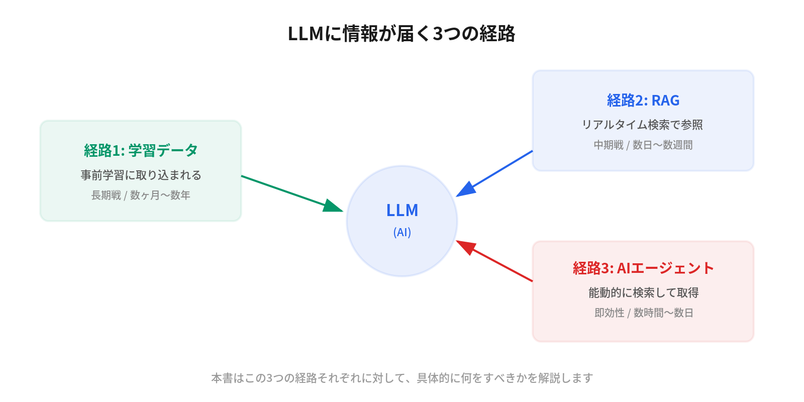

Your website is being ignored by ChatGPT.

Even if you rank #1 on Google, your site doesn't appear in AI-generated answers. Why?

# Introduction

## Background

One day, while reviewing the logs of my AI agent, I noticed something strange.

I was setting up an AI agent framework called OpenClaw. The configuration screen asked me to enter a "Brave Search API key." Not a Google API key. Brave. The AI agent I'd been delegating my daily research to wasn't using Google for web searches at all.

The search engine I'd been optimizing for and the search engine my AI actually used to retrieve information were completely different. This discovery inspired me to write this book.

As I dug deeper, I realized this wasn't just about my agent. The primary battleground of search is shifting from Google's "ten blue links" to AI's "single answer." And it's becoming clear that traditional SEO alone can't win on this new battlefield.

## Purpose of This Book

This book is a practical guide to getting your content "discovered" by LLMs (Large Language Models).

I call this field **LLMO** (Large Language Model Optimization). If SEO is the art of optimizing for Google's search algorithm, LLMO is the art of optimizing for AI's information retrieval mechanisms.

At the core of this book is the **Three Pathways Framework**. There are only three ways information reaches an LLM:

1. **Training Data**: Incorporated during the model's pre-training
2. **RAG** (Retrieval-Augmented Generation): Referenced through real-time search
3. **AI Agent Search Behavior**: Actively searched by CLI tools and agents

This book explains what specific actions to take for each of these three pathways.

## Target Audience

- Engineers and marketers with basic SEO knowledge
- Product managers seeking to improve AI search visibility
- Technical professionals who want to understand how AI search works in ChatGPT, Perplexity, Claude, etc.
- Executives and directors looking to update their content strategy for the AI era

## How to Read This Book

**Reading cover to cover:**
Reading from Chapter 1 sequentially will deepen your understanding progressively: "Why LLMO is necessary" → "Understanding the mechanics" → "Implementation" → "Measurement and improvement."

**Starting with implementation:**
Begin with Chapter 7 (Structured Data) and Chapter 8 (llms.txt / robots.txt), then refer back to earlier chapters as needed for the most efficient approach.

**For decision-makers:**
Read Chapter 1, Chapter 11 (Case Studies), and Chapter 12 (Future Outlook) first to get an overview of LLMO and gather material for investment decisions.

## Technical Environment

The code examples in this book have been tested in the following environments:

- Python 3.10 or higher
- Node.js 18 or higher
- Claude Code, Gemini CLI, Codex CLI (latest versions)

Code examples generally work as-is, though some require initial setup such as obtaining API keys. See each chapter's instructions for details.

---

Let's explore the new optimization strategies for the AI search era together.
