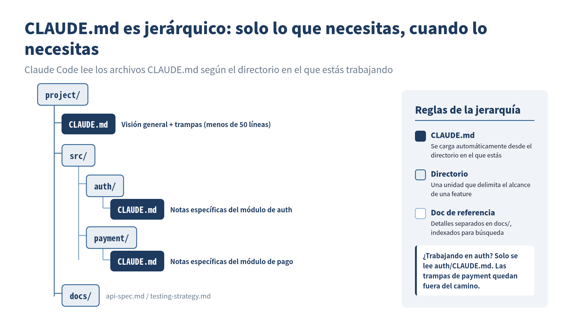

> **CLAUDE.md no es una "hoja de comandos para el modelo". Es una "base de conocimiento del proyecto".**
## Las dos líneas de Boris Cherny

:::message
 **Lo que aprenderás en este capítulo**
- La intención real detrás del CLAUDE.md de dos líneas de Boris Cherny y los malentendidos comunes
- Los pros y contras de CLAUDE.md: el problema del inflado y cómo combatirlo
- Siete principios prácticos para gestionar CLAUDE.md
- La esencia del Context Engineering (ingeniería de contexto)
- La relación entre Spec-Driven Development (SDD) y CLAUDE.md
:::

Voy a retomar un hecho del Capítulo 1. Boris Cherny, creador de Claude Code, tiene un CLAUDE.md que ocupa **solo dos líneas**.

```markdown
# CLAUDE.md
- Habilitar automerge al abrir un PR
- Postear en el canal interno de Slack al abrir un PR
```

Eso es todo. Sin convenciones de código, sin descripción de arquitectura, sin lineamientos de testing.

Mientras tanto, los practicantes de Claude Code escriben archivos CLAUDE.md que pasan de las 100 líneas. Empacan todo: el stack del proyecto, convenciones de código, estructura de archivos, estrategia de testing, procedimientos de deploy. El resultado es un CLAUDE.md gigante repleto de toda información imaginable.

¿Qué significa esa diferencia?

## Por qué Boris se las arregla con dos líneas

La respuesta es simple. El CLAUDE.md de Boris tiene dos líneas porque el resto de la información está consolidado en el **CLAUDE.md compartido por el equipo**.

En el proyecto de Claude Code existe un CLAUDE.md compartido en la raíz del repositorio, separado de los archivos CLAUDE.md individuales, y se **actualiza varias veces por semana**. El archivo personal de Boris tiene solo dos líneas porque el CLAUDE.md compartido cubre el contexto del equipo.

En otras palabras, es arriesgado concluir a la ligera que "CLAUDE.md debe ser corto". Más precisamente, **tu CLAUDE.md personal puede ser corto, pero el contexto del proyecto necesita existir en alguna parte**.

## Los pros y contras de CLAUDE.md

CLAUDE.md es una de las funcionalidades más innovadoras de Claude Code, pero también es **la más fácilmente malinterpretada**. Shingo Yoshida, autor del libro *Claude Code in Practice*, analiza los pros y contras de CLAUDE.md en el contexto del Spec-Driven Development (SDD).

### Pro: persistir el conocimiento del proyecto

La mayor ventaja de CLAUDE.md es ser **el único contexto que sobrevive al `/clear`**.

Las sesiones de Claude Code son temporales. Cuando la ventana de contexto se llena o se reinicia con `/clear`, toda la conversación previa se pierde. Pero la información escrita en CLAUDE.md persiste de forma permanente en el proyecto y se carga automáticamente en la siguiente sesión.

```
Sesión 1: instruir "escribe tests con Vitest" → Hecho
  ↓ /clear
Sesión 2: "Agrega tests" → no recuerda Vitest ❌

Con CLAUDE.md:
Sesión 2: "Agrega tests" → sabe usar Vitest por el CLAUDE.md ✅
```

Esto significa que CLAUDE.md funciona como **memoria de largo plazo**.

### Contra: el problema del inflado

Sin embargo, que CLAUDE.md funcione como memoria de largo plazo es, al mismo tiempo, **una causa de inflado**.

Cada vez que Claude se equivoca durante una sesión, agregas una regla: "de ahora en adelante, hazlo así". Cada vez que el proyecto crece, agregas nuevo contexto. Cuando te das cuenta, CLAUDE.md se infló a 300, 500, 1000 líneas.

Un CLAUDE.md inflado tiene los siguientes problemas:

**Problema 1: el modelo empieza a ignorar instrucciones**

Los LLM tienden a "darle más peso al inicio y al final de la entrada". Las instrucciones enterradas en medio de un CLAUDE.md gigante tienen más probabilidad de ser ignoradas por el modelo.

**Problema 2: se acumulan instrucciones contradictorias**

Cuando vas agregando durante mucho tiempo, las instrucciones viejas y las nuevas pueden contradecirse. Una instrucción vieja que dice "escribe tests con Jest" coexiste con una nueva que dice "los tests fueron migrados a Vitest".

**Problema 3: desperdicio de la ventana de contexto**

CLAUDE.md se carga por entero al inicio de la sesión. Un CLAUDE.md de 1000 líneas se come una porción significativa de la ventana de contexto disponible para las tareas reales.

El propio Boris dio un consejo claro sobre este problema:

> Si CLAUDE.md se vuelve demasiado largo, **bórralo y empieza de nuevo**. Si el modelo se desvía, empújalo de regreso de a poco. A medida que los modelos mejoran, necesitas agregar menos.

## Siete principios para CLAUDE.md

Con los pros y contras en mente, van aquí principios prácticos de operación. Estos siete principios sintetizan el conocimiento acumulado por la comunidad.

### Principio 1: mantenlo pequeño y enfocado

```markdown
# ✅ Bien: lo esencial mínimo
Este proyecto es Next.js 14 App Router + TypeScript + Prisma.
Los tests usan Vitest. Corre todos los tests con `npm test`.
Se prefieren comentarios en japonés.

# ❌ Mal: sobrecarga de información
Este proyecto es un sitio de e-commerce construido con Next.js 14
App Router + TypeScript + Prisma. El desarrollo empezó en
marzo de 2024, el equipo tiene 3 miembros... (sigue indefinidamente)
```

La meta es **menos de 300 líneas, con como máximo 150–200 instrucciones**. La generación automática vía `/init` tiende a ser verbosa, así que siempre haz curaduría manual después de generar.

### Principio 2: deja el estilo de código a los linters/formatters

```markdown
# ❌ Cosas que no deberían estar en CLAUDE.md
Usa indentación de 2 espacios.
Omite punto y coma.
Usa comillas simples para strings.

# ✅ Qué hacer en su lugar
Configura .prettierrc y .eslintrc
→ Una sola línea en CLAUDE.md: "Sigue las reglas de Lint/Formatter para el estilo de código"
```

Esta es la práctica de "No pelees con el modelo" explicada en el Capítulo 2. Delega el control de formato a las herramientas y escribe en CLAUDE.md solo **aquello en lo que quieres que el modelo ejerza juicio**.

### Principio 3: los tres elementos esenciales

Hay tres cosas que CLAUDE.md debe contener como mínimo:

```markdown
# CLAUDE.md

## Visión General del Proyecto
Sitio de e-commerce en Next.js 14, con gestión de productos, pedidos y pagos.

## Comandos comunes
- `npm run dev` — iniciar el dev server
- `npm test` — correr tests
- `npm run build` — build
- `npx prisma migrate dev` — migración del DB

## Trampas específicas del proyecto
- Si: el schema Prisma cambió → Entonces: corre siempre `npx prisma generate`
- Si: se agregó variable de entorno → Entonces: actualiza también `.env.example`
- Si: se agregó ruta de API → Entonces: actualiza las definiciones de tipo en `src/lib/api-client.ts`
```

El tercer elemento, "trampas específicas del proyecto", es particularmente importante. Escribe las trampas no solo como prohibiciones, sino en el formato **"Si X, entonces Y" (gatillo + acción)**. Así le resulta más fácil al modelo entender con precisión.

### Principio 4: divulgación progresiva

No necesitas poner todo en CLAUDE.md. Separa los detalles en archivos dedicados dentro de subdirectorios e incluye solo las referencias en CLAUDE.md.

```markdown
# CLAUDE.md (raíz)
Ve docs/api-spec.md para la especificación detallada de la API.
Ve docs/testing-strategy.md para la estrategia de tests.
Ve docs/deploy.md para los procedimientos de deploy.
```


*CLAUDE.md se posiciona de forma jerárquica: Claude Code lee automáticamente solo los archivos relevantes al directorio en el que está trabajando.*

Claude Code carga automáticamente el CLAUDE.md del directorio en el que está trabajando. Al trabajar en auth, carga `src/auth/CLAUDE.md`; al trabajar en pagos, carga `src/payment/CLAUDE.md`. Un diseño que ofrece **la información correcta, en el momento correcto**.

### Principio 5: pon las reglas críticas arriba

Los LLM tienden a darle más peso al inicio y al final de la entrada. Pon tus reglas más importantes en el **tope** del CLAUDE.md.

```markdown
# CLAUDE.md

<!-- Reglas más críticas: ponlas aquí -->
⚠️ Nunca te conectes directamente al DB de producción. Usa siempre staging.
⚠️ Nunca commitees archivos .env.

## Visión General del Proyecto
...
```

### Principio 6: hazlo crecer como documento vivo

CLAUDE.md no es algo que escribes una vez y olvidas. Cuando Claude repite el mismo error, agrega una línea de lección. Cuando la situación del proyecto cambia, actualízalo. Es un documento que exige **mantenimiento continuo**.

Pero, si solo agregas, se infla. Revísalo periódicamente y elimina las reglas que ya no son relevantes. Como dice Boris, a veces hay que tener el coraje de "borrarlo y empezar de nuevo".

### Principio 7: ten conciencia del alcance

La ubicación de CLAUDE.md determina su alcance.

```
~/.claude/CLAUDE.md          # Global (compartido entre todos los proyectos)
~/project/CLAUDE.md           # Raíz del proyecto
~/project/src/auth/CLAUDE.md  # Específico del módulo
~/project/claude.local.md     # Configuraciones personales (recomendado .gitignore)
```

Pon las reglas compartidas por el equipo en el CLAUDE.md de la raíz del proyecto, y las preferencias personales en `claude.local.md`, para **separar con claridad el conocimiento compartido de las configuraciones personales**.

## La pregunta de fondo: "¿qué es contexto?"

Cuando piensas a fondo en el diseño de CLAUDE.md, llegas a la pregunta de base: **"¿qué es contexto?"**

Contexto es la información que el modelo necesita para tomar decisiones correctas. Pero "información necesaria" cambia según la situación:

- Para captar la visión general del proyecto → descripción de la arquitectura
- Para arreglar un bug específico → trampas específicas de ese módulo
- Para escribir tests → estrategia de tests y configuración de las herramientas de test
- Para hacer deploy → procedimientos de deploy y configuraciones de entorno

Proveer toda la información de una sola vez sobrecarga la ventana de contexto y entierra la información importante. Proveer solo la información necesaria en el momento necesario: este es el centro del **Context Engineering (ingeniería de contexto)**.

CLAUDE.md es solamente un mecanismo para practicar esa ingeniería de contexto.

## La conexión con Spec-Driven Development (SDD)

**Spec-Driven Development** (SDD), promovido por Shingo Yoshida, es un enfoque que lleva la filosofía de CLAUDE.md aún más lejos.

La diferencia respecto al Vibe Coding ("haz algo lindo") es clara:

```
Vibe Coding:
  "Haz una funcionalidad de login" → la IA implementa libremente → no es lo que esperabas

Spec-Driven Development:
  1. Escribe el spec (deja claro qué construir)
  2. Define políticas de orientación en CLAUDE.md (deja claro cómo construir)
  3. Haz que la IA implemente → la implementación sigue el spec
  4. Verifica los resultados → actualiza el spec
```

El núcleo del SDD es concentrar el esfuerzo humano no en las **"instrucciones a la IA"**, sino en la **"definición de la especificación"**. Con un buen spec, la IA llega a la implementación correcta.

Este es también el enfoque que practico en el día a día. Antes de escribir código, escribo el spec primero. Defino el contexto del proyecto en CLAUDE.md. Luego delego la implementación a Claude Code. **Lo que debes escribir no es código, sino especificaciones**.

Esta idea se conecta de forma profunda con el "Document-First Development" tratado en el siguiente capítulo.

## Una plantilla práctica de CLAUDE.md

Para cerrar, va aquí la plantilla de CLAUDE.md que de hecho uso.

```markdown
# CLAUDE.md

## ⚠️ Reglas críticas
- No acceder al entorno de producción directamente
- No commitear archivos .env
- Pedir confirmación siempre antes de migraciones destructivas

## Visión General del Proyecto
[Nombre del proyecto]: [Descripción en una línea]

## Stack técnica
- Framework: Next.js 14 (App Router)
- Lenguaje: TypeScript (strict mode)
- DB: PostgreSQL + Prisma
- Tests: Vitest + Testing Library
- CI: GitHub Actions

## Comandos
- `npm run dev` — dev server
- `npm test` — correr tests
- `npm run test:watch` — tests en watch
- `npm run build` — build

## Trampas (Si → Entonces)
- Si: se agregó nueva ruta de API → Entonces: actualiza los tipos en `src/types/api.ts`
- Si: el schema Prisma cambió → Entonces: corre `npx prisma generate`
- Si: se agregó variable de entorno → Entonces: actualiza `.env.example` + documenta en el README

## Referencias
- Spec de la API: docs/api-spec.md
- Estrategia de tests: docs/testing.md
```

Cabe en 50 líneas. La información detallada queda separada en documentos referenciados, y CLAUDE.md sirve como **un índice**.

El CLAUDE.md de dos líneas de Boris puede ser extremo, pero la dirección es la correcta. **No escribas lo que no necesita ser escrito**. Pon la información necesaria en el lugar correcto, en la granularidad correcta. Ese es el corazón de la gestión de CLAUDE.md.


## ✅ Puntos clave

- El CLAUDE.md de dos líneas de Boris Cherny funciona porque el CLAUDE.md compartido por el equipo da la cobertura
- El inflado de CLAUDE.md causa tres problemas: instrucciones ignoradas, contradicciones acumuladas y contexto desperdiciado
- El núcleo de los siete principios: "mantenlo pequeño y enfocado", "déjalo a los linters" y "trampas en formato Si→Entonces"
- La divulgación progresiva provee la información correcta solo cuando es necesaria
- Diseña CLAUDE.md no como "órdenes al modelo", sino como "la base de conocimiento del proyecto"

## 🎯 Practícalo tú mismo

1. **Escribe un CLAUDE.md para tu proyecto**: siguiendo los siete principios de este capítulo, escribe un CLAUDE.md de 50 líneas o menos para un proyecto en el que estés trabajando ahora. Incluye los tres elementos esenciales: visión general del proyecto, comandos y trampas (en formato Si→Entonces).
2. **Pon a dieta un CLAUDE.md inflado**: si ya tienes un CLAUDE.md, revísalo a la luz de los principios de este capítulo y elimina lo que no necesita estar ahí. Identifica los ítems que deberían quedar con los linters/formatters, las instrucciones duplicadas y las reglas desactualizadas. Compara el conteo de líneas antes y después.

---

**Referencias**

- Boris Cherny, "Inside Claude Code With Its Creator", Y Combinator The Light Cone (17/02/2026)
- Shingo Yoshida, "Introduction to Spec-Driven Development with Claude Code", SpeakerDeck
