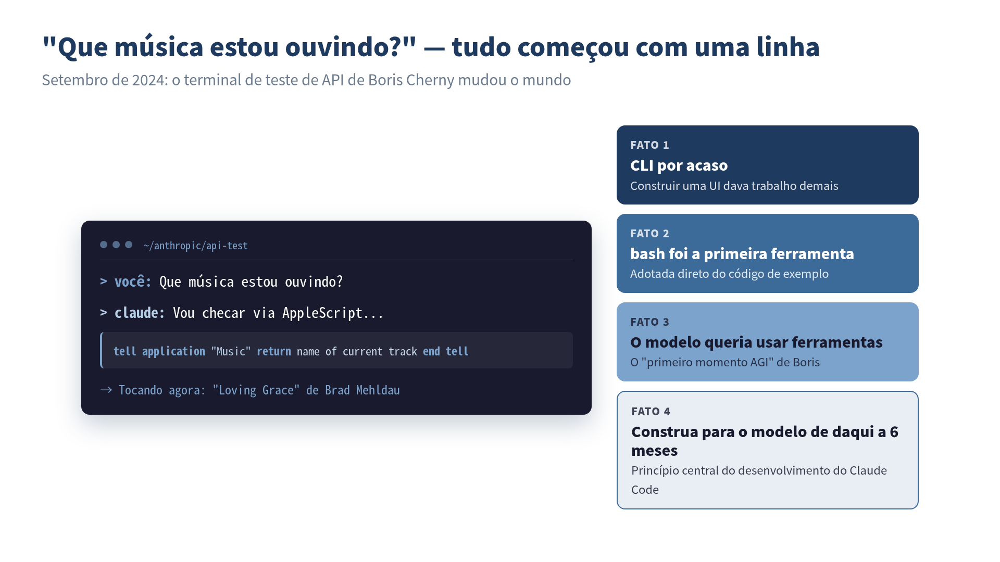

> **"Então, que música você está ouvindo agora?" Essa única pergunta começou tudo.**


*O momento icônico em que o Claude Code nasceu: um protótipo acidental que cristalizou quatro decisões de design.*

## "Que Música Estou Ouvindo?"

:::message
 **O que você vai aprender neste capítulo**
- Como o Claude Code nasceu como um "produto acidental"
- A filosofia de design de Boris Cherny e seus paralelos com TypeScript
- A descoberta crucial de que "modelos querem usar ferramentas"
- Como a cultura de segurança da Anthropic moldou o design do Claude Code
- O princípio de desenvolvimento "construa para o modelo daqui a seis meses"
:::

Numa noite de setembro de 2024, o engenheiro da Anthropic Boris Cherny escrevia um app de chat de terminal simples para testar o comportamento da API da empresa.

A primeira ferramenta foi só `bash`, uma única ferramenta. Era um protótipo sem nada de especial, montado quase inteiramente a partir do código de exemplo da documentação oficial. Para verificar se funcionava, ele digitou:

```
What music am I listening to?
```

O modelo escreveu espontaneamente um AppleScript, controlou o player de música do Mac e devolveu o nome da música tocando.

Boris diz que esse foi o momento em que "sentiu AGI pela primeira vez". Sem nunca ter sido instruído a fazer isso, o modelo **quis usar ferramentas**. "O modelo quer usar ferramentas. É só isso." Essa descoberta foi o começo do Claude Code.

## Quem é Boris Cherny?

Para contar a história do nascimento do Claude Code, primeiro precisamos conhecer seu criador, Boris Cherny.

Ele é conhecido como autor de *Programming TypeScript*, publicado pela O'Reilly, e é especialista em sistemas de tipos e design de linguagens de programação. TypeScript carrega uma filosofia de "adaptar o sistema de tipos ao jeito que os programadores escrevem, em vez de forçar os programadores a mudar seus hábitos". Essa filosofia depois influenciou diretamente os princípios de design do Claude Code.

Quando Boris entrou na Anthropic, não tinha planos de construir um produto como o Claude Code. O que queria era entender mais a fundo a API da empresa. O pequeno app de terminal que ele construiu para isso acabou se tornando um dos agentes de coding com IA mais usados do mundo, algo que nem ele mesmo previu.

Essa história me atrai porque ressoa com minha experiência. Na época em que trabalhei com robótica, construí um pequeno protótipo com um engenheiro francês que cresceu em direções inesperadas. Em vez de desenhar um grande projeto desde o início, há uma sensação de que **a descoberta vem quando você põe a mão na massa**. Acho que todo engenheiro já sentiu isso em algum momento.

## Nascido de um Hackathon Interno: por Acaso

Claude Code não foi resultado de um esforço planejado de desenvolvimento de produto. O app de terminal que Boris construiu para testar comportamento de API era puramente uma ferramenta de experimentação pessoal.

Mas duas coincidências felizes se juntaram.

**Coincidência #1: Escolher uma CLI**

Boris escolheu uma CLI por uma razão extremamente prática: **não precisava construir UI**. Pegou o terminal como o protótipo mais barato possível. Sem UI web, sem app desktop. Só texto entrando, texto saindo. A forma mais simples possível.

Esse "atalho" se mostrou a melhor decisão de design. O terminal era o ambiente com o qual desenvolvedores estavam mais familiarizados, e também o ambiente mais natural para modelos usarem ferramentas.

**Coincidência #2: Fazer do bash a primeira ferramenta**

Ao usar a ferramenta bash direto do código de exemplo da documentação, o modelo ganhou um ambiente onde podia executar comandos livremente. Não foi uma escolha intencional de design. Só aconteceu assim. Mas esse grau de liberdade combinou perfeitamente com a tendência do modelo de "querer usar ferramentas".

Quando Boris compartilhou esse protótipo internamente, a reação foi inesperada. Engenheiros da Anthropic começaram a **usar a ferramenta no trabalho do dia a dia**.

## "Ninguém Pediu, mas Todo Mundo Precisava"

No fim de 2024, o mercado de ferramentas de coding com IA já tinha players fortes como Cursor e GitHub Copilot. Assistentes de IA integrados a IDE eram o padrão, e praticamente não havia demanda por "escrever código conversando com IA no terminal".

Mesmo assim, a adoção interna rápida do Claude Code revelou uma verdade importante: **as pessoas não sabem do que precisam até terem aquilo nas mãos**.

Boris explica isso usando o conceito de **"Demanda Latente"**. Engenheiros já trabalhavam no terminal. Claude Code era uma ferramenta que se misturou naturalmente ao fluxo de trabalho deles. Você usa o terminal de sempre, trabalha como sempre. Só que agora o Claude está ali do seu lado.

Essa ideia de "colocar o produto na extensão dos padrões de comportamento existentes" é um dos fatores mais importantes por trás do sucesso do Claude Code. Vou tratar disso em detalhe no Capítulo 3.

## O Que a Cultura da Anthropic Produziu

Não dá para contar a história do nascimento do Claude Code sem considerar a cultura da Anthropic como empresa.

A Anthropic é única no setor por colocar "segurança em IA" no centro da sua missão corporativa. Persegue os objetivos aparentemente contraditórios de maximizar a capacidade da IA enquanto, ao mesmo tempo, garante sua segurança.

Como essa cultura influenciou o Claude Code fica evidente em várias decisões de design.

**Gerenciamento de Permissões para Execução de Ferramentas**

Claude Code tem um mecanismo embutido que pede aprovação do usuário quando o modelo modifica arquivos ou executa comandos. Em vez de "deixar a IA fazer o que quiser", a filosofia de design é **deixar o controle nas mãos do humano**.

```
Claude wants to run: rm -rf node_modules && npm install

Allow? (y/n)
```

Esse prompt pode parecer chato à primeira vista. Mas é a implementação técnica da ênfase da Anthropic em "supervisão humana".

**Projetado para Não Enviar Código para Fora**

Claude Code não armazena seu codebase em um vector DB nem constrói índices em servidores externos. A arquitetura em que o modelo busca direto nos arquivos locais via grep/glob é **também uma escolha excelente do ponto de vista de segurança**.

Essa decisão foi tomada inicialmente por razões técnicas (Agentic Search era mais preciso que RAG), mas se alinhou lindamente com a cultura safety-first da Anthropic.

**Consciência de ASL (AI Safety Level)**

Boris conversa abertamente em entrevistas sobre riscos como ASL4 (o nível de risco para modelos que se auto-aprimoram recursivamente), uso indevido para armas biológicas e exploits zero-day. O simples fato de um desenvolvedor de ferramenta de coding com IA discutir esses riscos publicamente reflete a cultura da Anthropic.

Quando comecei a usar Claude Code, a primeira coisa que notei foi esse "cuidado com segurança". Comparado a outras ferramentas de coding com IA, Claude Code **restringe intencionalmente o que pode fazer** em certas áreas. Mas isso não é limitação: é design. Em vez de soltar a rédea, foi projetado para colaborar com humanos. Essa filosofia é o que cria confiabilidade no uso real.

## Vinte Pull Requests por Dia

A evidência mais convincente da efetividade do Claude Code vem dos próprios resultados internos da Anthropic.

O estilo de trabalho de Boris mudou dramaticamente antes e depois de adotar Claude Code:

- Desde o Opus 4.5, ele escreve **100%** do código com Claude Code
- Desinstalou a IDE
- Manda **20** pull requests por dia

A equipe como um todo reportou resultados como:

- **Aumento de 150%** em produtividade por engenheiro
- A previsão do CEO Dario de que "90% do código será escrito pelo Claude" virou realidade
- Dependendo da equipe, **70–90%** do código é gerado por IA

O ex-engenheiro do Google Steve Yegge disse que "engenheiros da Anthropic são 1000x mais produtivos que engenheiros do Google na época de ouro do Google". Pode ser exagero, mas a sensação de que a produtividade mudou para uma dimensão completamente diferente é algo que vivi na pele usando Claude Code intensivamente.

No meu caso, toco cinco projetos em paralelo numa pequena empresa enquanto, ao mesmo tempo, faço cursos de extensão universitária e preparo novos negócios. Esse estilo de trabalho de "vestir vários chapéus" se tornou possível em grande parte graças ao Claude Code. A redução dramática no tempo gasto escrevendo código me permitiu **focar em decisão e revisão**.

## Não Sobra Nenhuma Linha de Código de Seis Meses Atrás

A própria equipe de desenvolvimento do Claude Code pratica uma metodologia de desenvolvimento interessante.

Segundo Boris, **nenhuma linha de código de seis meses atrás permanece** no codebase do Claude Code. Eles adicionam e removem ferramentas a cada poucas semanas; o código tem expectativa de vida de poucos meses. Reescrevem código constantemente para acompanhar a evolução do modelo.

Isso reflete a filosofia dele de que "scaffolding = dívida técnica".

> Você consegue ganhos de 10–20% em performance com código em volta do modelo (scaffolding). Mas o próximo modelo apaga esses ganhos. É sempre um tradeoff entre construir e esperar.

Boris, segundo se conta, tem o ensaio de Rich Sutton **"The Bitter Lesson"** emoldurado na parede do escritório. A tese central desse ensaio é que "no longo prazo, escalar computação supera engenhosidade humana". Em outras palavras, em vez de construir sistemas complexos em volta do modelo, é melhor **apostar na evolução do próprio modelo**.

Esse pensamento leva ao princípio central do desenvolvimento do Claude Code:

> Construa não para o modelo de hoje, mas para o modelo daqui a seis meses.

Mesmo que você ache PMF (Product Market Fit) otimizando para o modelo de hoje, o próximo modelo deixa concorrentes te ultrapassarem. Então você percebe os limites da capacidade do modelo e aposta na fronteira que será resolvida em seis meses.

Esse princípio tem implicações importantes para nós como usuários do Claude Code. Seja em como escrevemos CLAUDE.md ou como desenhamos workflows, a chave não é "hackear em volta das fraquezas do modelo atual", mas **manter as coisas simples, assumindo que o modelo vai evoluir**.

## Da Coincidência à Inevitabilidade

O nascimento do Claude Code foi coincidente. Um app de terminal para testar API, a ferramenta bash do código de exemplo, escolher uma CLI porque "construir UI dava muito trabalho". Nada disso foi intencional.

Mas o cenário que se desdobrou a partir dessas coincidências foi nada menos que inevitável:

- Engenheiros já trabalhavam no terminal → CLI
- Modelos queriam usar ferramentas → bash
- Segurança e simplicidade eram necessárias → Agentic Search
- Controle humano era necessário → gerenciamento de permissões baseado em aprovação

Tudo era resposta a **demanda que já estava ali**.

O que quero passar neste livro não é só como usar Claude Code. Ao entender a filosofia por trás de sua criação ("não brigue com o modelo", "descubra demanda latente", "construa para daqui a seis meses"), você vai descobrir **princípios para desenvolver junto com IA** que vão além do mero uso da ferramenta.

No próximo capítulo, vamos cavar mais fundo na pergunta "Por que o terminal?" e chegar ao coração da filosofia de design do Claude Code.


## ✅ Pontos-chave

- Claude Code não foi um produto planejado: nasceu acidentalmente de uma ferramenta de teste de API
- A descoberta de que "modelos querem usar ferramentas" foi o começo de tudo
- As escolhas de terminal, bash e Agentic Search foram todas respostas a "demanda existente"
- A cultura de segurança da Anthropic levou a uma filosofia de design que mantém humanos no controle
- "Construa não para o modelo de hoje, mas para o modelo daqui a seis meses" é o princípio central de desenvolvimento do Claude Code

---

**Referências**

- Boris Cherny, "Inside Claude Code With Its Creator" — Y Combinator The Light Cone (2026-02-17)
