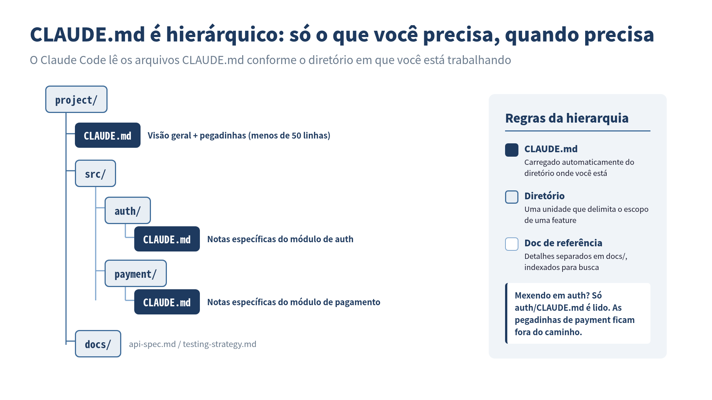

> **CLAUDE.md não é uma "folha de comandos para o modelo". É uma "base de conhecimento para o projeto".**
## As duas linhas de Boris Cherny

:::message
 **O que você vai aprender neste capítulo**
- A intenção real por trás do CLAUDE.md de duas linhas de Boris Cherny e os equívocos comuns
- Os prós e contras do CLAUDE.md: o problema do inchaço e como combatê-lo
- Sete princípios práticos para o gerenciamento do CLAUDE.md
- A essência do Context Engineering (engenharia de contexto)
- A relação entre Spec-Driven Development (SDD) e CLAUDE.md
:::

Vou retomar um fato do Capítulo 1. Boris Cherny, criador do Claude Code, tem um CLAUDE.md que ocupa **apenas duas linhas**.

```markdown
# CLAUDE.md
- Habilitar automerge ao abrir um PR
- Postar no canal interno do Slack ao abrir um PR
```

É só isso. Sem convenções de código, sem descrição de arquitetura, sem diretrizes de teste.

Enquanto isso, praticantes do Claude Code escrevem arquivos CLAUDE.md que passam de 100 linhas. Empacotam tudo: a stack do projeto, convenções de código, estrutura de arquivos, estratégia de testes, procedimentos de deploy. O resultado é um CLAUDE.md gigante recheado de toda informação imaginável.

O que essa diferença significa?

## Por que Boris consegue se virar com duas linhas

A resposta é simples. O CLAUDE.md de Boris tem duas linhas porque o restante das informações está consolidado no **CLAUDE.md compartilhado pelo time**.

No projeto do Claude Code existe um CLAUDE.md compartilhado na raiz do repositório, separado dos arquivos CLAUDE.md individuais, e que é **atualizado várias vezes por semana**. O arquivo pessoal de Boris tem apenas duas linhas porque o CLAUDE.md compartilhado cobre o contexto do time.

Em outras palavras, é arriscado concluir levianamente que "CLAUDE.md deve ser curto". Mais precisamente, **seu CLAUDE.md pessoal pode ser curto, mas o contexto do projeto precisa existir em algum lugar**.

## Os prós e contras do CLAUDE.md

CLAUDE.md é uma das funcionalidades mais inovadoras do Claude Code, mas também é **a mais facilmente mal compreendida**. Shingo Yoshida, autor do livro *Claude Code in Practice*, analisa os prós e contras do CLAUDE.md no contexto do Spec-Driven Development (SDD).

### Pró: persistir o conhecimento do projeto

A maior vantagem do CLAUDE.md é ser **o único contexto que sobrevive ao `/clear`**.

Sessões do Claude Code são temporárias. Quando a janela de contexto enche ou você reseta com `/clear`, toda a conversa anterior se perde. Mas a informação escrita no CLAUDE.md persiste de forma permanente no projeto e é carregada automaticamente na próxima sessão.

```
Sessão 1: instruir "escreva testes com Vitest" → Feito
  ↓ /clear
Sessão 2: "Adicione testes" → não lembra de Vitest ❌

Com CLAUDE.md:
Sessão 2: "Adicione testes" → sabe usar Vitest pelo CLAUDE.md ✅
```

Isso significa que o CLAUDE.md funciona como **memória de longo prazo**.

### Contra: o problema do inchaço

Porém, o CLAUDE.md funcionar como memória de longo prazo é, ao mesmo tempo, **uma causa de inchaço**.

Toda vez que o Claude erra durante uma sessão, você adiciona uma regra: "a partir de agora, faça assim". Toda vez que o projeto cresce, você adiciona novo contexto. Quando vê, o CLAUDE.md inflou para 300, 500, 1000 linhas.

Um CLAUDE.md inchado tem os seguintes problemas:

**Problema 1: o modelo começa a ignorar instruções**

LLMs tendem a "dar mais peso ao começo e ao fim da entrada". Instruções enterradas no meio de um CLAUDE.md gigante têm mais chance de serem ignoradas pelo modelo.

**Problema 2: instruções contraditórias se acumulam**

Quando você fica acrescentando ao longo de muito tempo, instruções antigas e novas podem se contradizer. Uma instrução antiga dizendo "escreva testes com Jest" coexiste com uma nova dizendo "os testes foram migrados para Vitest".

**Problema 3: desperdício da janela de contexto**

O CLAUDE.md é carregado por inteiro no início da sessão. Um CLAUDE.md de 1000 linhas come uma fatia significativa da janela de contexto disponível para as tarefas reais.

O próprio Boris deu um conselho claro sobre esse problema:

> Se o CLAUDE.md ficar longo demais, **apague e comece de novo**. Se o modelo desviar, vá empurrando de volta aos poucos. À medida que os modelos melhoram, você precisa adicionar menos.

## Sete princípios para o CLAUDE.md

Com os prós e contras em mente, vão aqui princípios práticos de operação. Esses sete princípios sintetizam o conhecimento acumulado pela comunidade.

### Princípio 1: mantenha pequeno e focado

```markdown
# ✅ Bom: o essencial mínimo
Este projeto é Next.js 14 App Router + TypeScript + Prisma.
Os testes usam Vitest. Rode todos os testes com `npm test`.
Comentários em japonês são preferíveis.

# ❌ Ruim: sobrecarga de informação
Este projeto é um site de e-commerce construído com Next.js 14
App Router + TypeScript + Prisma. O desenvolvimento começou em
março de 2024, o time tem 3 membros... (segue indefinidamente)
```

A meta é **menos de 300 linhas, com no máximo 150–200 instruções**. A geração automática via `/init` tende a ser verbosa, então sempre faça curadoria manual depois da geração.

### Princípio 2: deixe o estilo de código para os linters/formatters

```markdown
# ❌ Coisas que não deveriam estar no CLAUDE.md
Use indentação de 2 espaços.
Omita ponto e vírgula.
Use aspas simples para strings.

# ✅ O que fazer no lugar
Configure .prettierrc e .eslintrc
→ Uma única linha no CLAUDE.md: "Siga as regras do Lint/Formatter para o estilo de código"
```

Esta é a prática de "Não brigue com o modelo" explicada no Capítulo 2. Delegue o controle de formatação às ferramentas e escreva no CLAUDE.md apenas **aquilo em que você quer que o modelo exerça julgamento**.

### Princípio 3: os três elementos essenciais

Há três coisas que o CLAUDE.md deve conter no mínimo:

```markdown
# CLAUDE.md

## Visão Geral do Projeto
Site de e-commerce em Next.js 14, com gerenciamento de produtos, pedidos e pagamentos.

## Comandos Comuns
- `npm run dev` — iniciar o dev server
- `npm test` — rodar testes
- `npm run build` — build
- `npx prisma migrate dev` — migração do DB

## Pegadinhas específicas do projeto
- Se: schema Prisma mudou → Então: rode sempre `npx prisma generate`
- Se: variável de ambiente foi adicionada → Então: atualize também o `.env.example`
- Se: rota de API foi adicionada → Então: atualize as definições de tipo em `src/lib/api-client.ts`
```

O terceiro elemento, "pegadinhas específicas do projeto", é particularmente importante. Escreva as pegadinhas não apenas como proibições, mas no formato **"Se X, então Y" (gatilho + ação)**. Assim fica mais fácil para o modelo entender com precisão.

### Princípio 4: divulgação progressiva

Você não precisa colocar tudo no CLAUDE.md. Separe os detalhes em arquivos dedicados em subdiretórios e inclua só as referências no CLAUDE.md.

```markdown
# CLAUDE.md (raiz)
Veja docs/api-spec.md para a especificação detalhada da API.
Veja docs/testing-strategy.md para a estratégia de testes.
Veja docs/deploy.md para os procedimentos de deploy.
```


*O CLAUDE.md é posicionado de forma hierárquica: o Claude Code lê automaticamente apenas os arquivos relevantes ao diretório em que está trabalhando.*

O Claude Code carrega automaticamente o CLAUDE.md do diretório em que está trabalhando. Ao trabalhar em auth, carrega `src/auth/CLAUDE.md`; ao trabalhar em pagamentos, carrega `src/payment/CLAUDE.md`. Um design que oferece **a informação certa, na hora certa**.

### Princípio 5: coloque as regras críticas no topo

LLMs tendem a dar mais peso ao começo e ao fim da entrada. Coloque suas regras mais importantes no **topo** do CLAUDE.md.

```markdown
# CLAUDE.md

<!-- Regras mais críticas: coloque aqui -->
⚠️ Nunca conecte diretamente ao DB de produção. Use sempre o staging.
⚠️ Nunca commitar arquivos .env.

## Visão Geral do Projeto
...
```

### Princípio 6: faça crescer como documento vivo

O CLAUDE.md não é algo que você escreve uma vez e esquece. Quando o Claude repete o mesmo erro, acrescente uma linha de lição. Quando a situação do projeto muda, atualize. É um documento que exige **manutenção contínua**.

Mas, se você só acrescenta, ele incha. Revise periodicamente e remova regras que não são mais relevantes. Como diz Boris, às vezes é preciso ter a coragem de "apagar e começar de novo".

### Princípio 7: tenha consciência do escopo

A localização do CLAUDE.md determina seu escopo.

```
~/.claude/CLAUDE.md          # Global (compartilhado entre todos os projetos)
~/project/CLAUDE.md           # Raiz do projeto
~/project/src/auth/CLAUDE.md  # Específico do módulo
~/project/claude.local.md     # Configurações pessoais (recomendado .gitignore)
```

Coloque as regras compartilhadas pelo time no CLAUDE.md da raiz do projeto, e as preferências pessoais em `claude.local.md`, para **separar com clareza o conhecimento compartilhado das configurações pessoais**.

## A pergunta essencial: "O que é contexto?"

Quando você pensa profundamente no design do CLAUDE.md, chega à pergunta fundamental: **"O que é contexto?"**

Contexto é a informação de que o modelo precisa para tomar decisões corretas. Mas "informação necessária" muda conforme a situação:

- Para captar a visão geral do projeto → descrição da arquitetura
- Para corrigir um bug específico → pegadinhas específicas daquele módulo
- Para escrever testes → estratégia de testes e configuração das ferramentas de teste
- Para fazer deploy → procedimentos de deploy e configurações de ambiente

Fornecer toda a informação de uma vez sobrecarrega a janela de contexto e enterra a informação importante. Fornecer só a informação necessária no momento necessário: esta é a essência do **Context Engineering (engenharia de contexto)**.

O CLAUDE.md é apenas um mecanismo para praticar essa engenharia de contexto.

## A conexão com Spec-Driven Development (SDD)

**Spec-Driven Development** (SDD), defendido por Shingo Yoshida, é uma abordagem que leva a filosofia do CLAUDE.md ainda mais longe.

A diferença em relação ao Vibe Coding ("faça algo legal aí") é clara:

```
Vibe Coding:
  "Faça uma funcionalidade de login" → IA implementa livremente → não é o que você esperava

Spec-Driven Development:
  1. Escreva o spec (deixe claro o que construir)
  2. Defina políticas de orientação no CLAUDE.md (deixe claro como construir)
  3. Faça a IA implementar → a implementação segue o spec
  4. Verifique os resultados → atualize o spec
```

O núcleo do SDD é concentrar o esforço humano não nas **"instruções para a IA"**, mas na **"definição da especificação"**. Com um bom spec, a IA chega à implementação correta.

Esta é também a abordagem que pratico no dia a dia. Antes de escrever código, escrevo o spec primeiro. Defino o contexto do projeto no CLAUDE.md. Em seguida, delego a implementação ao Claude Code. **O que você deve escrever não é código, é especificação**.

Essa ideia se conecta de forma profunda com o "Document-First Development" discutido no próximo capítulo.

## Um template prático de CLAUDE.md

Para fechar, segue o template de CLAUDE.md que de fato uso.

```markdown
# CLAUDE.md

## ⚠️ Regras críticas
- Não acessar o ambiente de produção diretamente
- Não commitar arquivos .env
- Pedir confirmação sempre antes de migrações destrutivas

## Visão Geral do Projeto
[Nome do projeto]: [Descrição em uma linha]

## Stack técnica
- Framework: Next.js 14 (App Router)
- Linguagem: TypeScript (strict mode)
- DB: PostgreSQL + Prisma
- Testes: Vitest + Testing Library
- CI: GitHub Actions

## Comandos
- `npm run dev` — dev server
- `npm test` — rodar testes
- `npm run test:watch` — testes em watch
- `npm run build` — build

## Pegadinhas (Se → Então)
- Se: nova rota de API foi adicionada → Então: atualize os tipos em `src/types/api.ts`
- Se: schema Prisma mudou → Então: rode `npx prisma generate`
- Se: variável de ambiente foi adicionada → Então: atualize `.env.example` + documente no README

## Referências
- Spec da API: docs/api-spec.md
- Estratégia de testes: docs/testing.md
```

Cabe em 50 linhas. As informações detalhadas ficam separadas em documentos referenciados, e o CLAUDE.md serve como **um índice**.

O CLAUDE.md de duas linhas de Boris pode ser extremo, mas a direção está certa. **Não escreva o que não precisa ser escrito**. Coloque a informação necessária no lugar certo, na granularidade certa. Esta é a essência do gerenciamento do CLAUDE.md.


## ✅ Pontos-chave

- O CLAUDE.md de duas linhas de Boris Cherny funciona porque o CLAUDE.md compartilhado pelo time dá a cobertura
- O inchaço do CLAUDE.md causa três problemas: instruções ignoradas, contradições acumuladas e contexto desperdiçado
- O núcleo dos sete princípios: "mantenha pequeno e focado", "deixe para os linters" e "pegadinhas no formato Se→Então"
- A divulgação progressiva fornece a informação certa só quando necessária
- Projete o CLAUDE.md não como "ordens para o modelo", mas como "a base de conhecimento do projeto"

## 🎯 Pratique você mesmo

1. **Escreva um CLAUDE.md para seu projeto**: seguindo os sete princípios deste capítulo, escreva um CLAUDE.md de 50 linhas ou menos para um projeto em que você esteja trabalhando agora. Inclua os três elementos essenciais: visão geral do projeto, comandos e pegadinhas (no formato Se→Então).
2. **Coloque um CLAUDE.md inchado em dieta**: se você já tem um CLAUDE.md, revise-o à luz dos princípios deste capítulo e remova o que não precisa estar lá. Identifique itens que deveriam ficar com os linters/formatters, instruções duplicadas e regras desatualizadas. Compare a contagem de linhas antes e depois.

---

**Referências**

- Boris Cherny, "Inside Claude Code With Its Creator", Y Combinator The Light Cone (17/02/2026)
- Shingo Yoshida, "Introduction to Spec-Driven Development with Claude Code", SpeakerDeck
